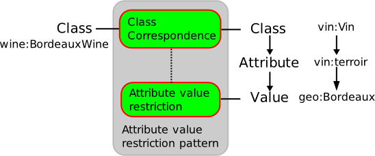

__Alignment Ontology Design Patterns (Alignment OPs)__

Alignment OPs refer to correspondences between ontologies. Each pattern models a relation between two entities or sets of entities in two ontologies. Instantiation of an Alignment OP results in a correspondence between elements of two given ontologies.

  

##   Description

Ontology alignment aims at providing correspondences between ontologies modeling a similar domain. Alignment patterns are template representing frequent types of alignments occurring when aligning ontologies.

Example: Class correspondence with attribute value restriction

## Subcategories

This category has only the following subcategory.

### P

* [ProposedAlignmentOP](../Category/ProposedAlignmentOP "Category:ProposedAlignmentOP")

## Pages in category "AlignmentOP"

The following 14 pages are in this category, out of 14 total.

Retrieved from "[http://ontologydesignpatterns.org/wiki/Category:AlignmentOP](../Category/AlignmentOP)"
 [Category](http://ontologydesignpatterns.org/wiki/Special:Categories "Special:Categories"): [CorrespondenceOP](../Category/CorrespondenceOP "Category:CorrespondenceOP")