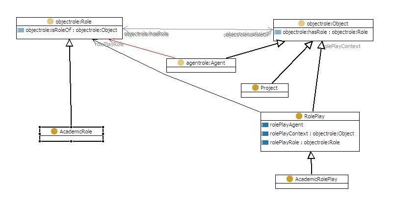

#  AcademicRoles


__Title:__ Academic People and their Roles


__Description:__ I need to represent people of the academic staff. Each person can play different roles in different contexts. 


__Diagram__


[](../Image/MI-AcademicRole.jpg "Image:MI-AcademicRole.jpg")


#  About


  


#  Additional information


This new pattern imports the objectrole pattern and adds a few things. We need to represent an __agent__ that is __playing a role__ in a given __context__. This would be most natural to represent as a ternary relation, but for OWL we reify this as a Class called RolePlay (RoleInContext would also be a good name). RolePlay has three properties:


1. Context (e.g. the NEON project)
2. Player - the Agent playing the role (e.g. Enrico)
3. Role - the role being played) (e.g. Coordinator)


We also add some new classes and instances:


* Agent and a subclase Person with one instance, Enrico
* AcademicRole with two instances: Coordinator and Professor


  

NB: probably this pattern should be renamed to be something like 'RoleInContext' and then specialized for academic roles in context.


<?xml version="1.0"?>
<rdf:RDF


```
   xmlns:rdf="[http://www.w3.org/1999/02/22-rdf-syntax-ns#](http://www.w3.org/1999/02/22-rdf-syntax-ns# "http://www.w3.org/1999/02/22-rdf-syntax-ns#")"
   xmlns="[http://www.ontologydesignpatterns.org/cp/owl/academicrole.owl#](http://www.ontologydesignpatterns.org/cp/owl/academicrole.owl# "http://www.ontologydesignpatterns.org/cp/owl/academicrole.owl#")"
   xmlns:objectrole="[http://www.ontologydesignpatterns.org/cp/owl/objectrole.owl#](http://www.ontologydesignpatterns.org/cp/owl/objectrole.owl# "http://www.ontologydesignpatterns.org/cp/owl/objectrole.owl#")"
   xmlns:agentrole="[http://www.ontologydesignpatterns.org/cp/owl/agentrole.owl#](http://www.ontologydesignpatterns.org/cp/owl/agentrole.owl# "http://www.ontologydesignpatterns.org/cp/owl/agentrole.owl#")"
   xmlns:owl="[http://www.w3.org/2002/07/owl#](http://www.w3.org/2002/07/owl# "http://www.w3.org/2002/07/owl#")"
   xmlns:xsd="[http://www.w3.org/2001/XMLSchema#](http://www.w3.org/2001/XMLSchema# "http://www.w3.org/2001/XMLSchema#")"
   xmlns:rdfs="[http://www.w3.org/2000/01/rdf-schema#](http://www.w3.org/2000/01/rdf-schema# "http://www.w3.org/2000/01/rdf-schema#")"
 xml:base="[http://www.ontologydesignpatterns.org/cp/owl/academicrole.owl](http://www.ontologydesignpatterns.org/cp/owl/academicrole.owl "http://www.ontologydesignpatterns.org/cp/owl/academicrole.owl")">
 <owl:Ontology rdf:about="">
   <owl:versionInfo rdf:datatype="[http://www.w3.org/2001/XMLSchema#string](http://www.w3.org/2001/XMLSchema#string "http://www.w3.org/2001/XMLSchema#string")"
   >Created with TopBraid Composer</owl:versionInfo>
   <owl:imports rdf:resource="[http://ontologydesignpatterns.org/cp/owl/agentrole.owl](http://ontologydesignpatterns.org/cp/owl/agentrole.owl "http://ontologydesignpatterns.org/cp/owl/agentrole.owl")"/>
 </owl:Ontology>
 <owl:Class rdf:ID="Person">
   <rdfs:subClassOf rdf:resource="[http://www.ontologydesignpatterns.org/cp/owl/agentrole.owl#Agent](http://www.ontologydesignpatterns.org/cp/owl/agentrole.owl#Agent "http://www.ontologydesignpatterns.org/cp/owl/agentrole.owl#Agent")"/>
 </owl:Class>
 <owl:Class rdf:ID="AcademicRolePlay">
   <rdfs:subClassOf>
     <owl:Class rdf:ID="RolePlay"/>
   </rdfs:subClassOf>
 </owl:Class>
 <owl:Class rdf:ID="AcademicRole">
   <rdfs:subClassOf rdf:resource="[http://www.ontologydesignpatterns.org/cp/owl/objectrole.owl#Role](http://www.ontologydesignpatterns.org/cp/owl/objectrole.owl#Role "http://www.ontologydesignpatterns.org/cp/owl/objectrole.owl#Role")"/>
 </owl:Class>
 <owl:Class rdf:about="#RolePlay">
   <rdfs:subClassOf rdf:resource="[http://www.ontologydesignpatterns.org/cp/owl/objectrole.owl#Object](http://www.ontologydesignpatterns.org/cp/owl/objectrole.owl#Object "http://www.ontologydesignpatterns.org/cp/owl/objectrole.owl#Object")"/>
 </owl:Class>
 <owl:Class rdf:ID="Project">
   <rdfs:subClassOf rdf:resource="[http://www.ontologydesignpatterns.org/cp/owl/objectrole.owl#Object](http://www.ontologydesignpatterns.org/cp/owl/objectrole.owl#Object "http://www.ontologydesignpatterns.org/cp/owl/objectrole.owl#Object")"/>
 </owl:Class>
 <owl:ObjectProperty rdf:ID="rolePlayAgent">
   <rdfs:domain rdf:resource="#RolePlay"/>
 </owl:ObjectProperty>
 <owl:ObjectProperty rdf:ID="rolePlayRole">
   <rdfs:domain rdf:resource="#RolePlay"/>
   <rdfs:range rdf:resource="[http://www.ontologydesignpatterns.org/cp/owl/objectrole.owl#Role](http://www.ontologydesignpatterns.org/cp/owl/objectrole.owl#Role "http://www.ontologydesignpatterns.org/cp/owl/objectrole.owl#Role")"/>
 </owl:ObjectProperty>
 <owl:ObjectProperty rdf:ID="rolePlayContext">
   <rdfs:domain rdf:resource="#RolePlay"/>
   <rdfs:range rdf:resource="[http://www.ontologydesignpatterns.org/cp/owl/objectrole.owl#Object](http://www.ontologydesignpatterns.org/cp/owl/objectrole.owl#Object "http://www.ontologydesignpatterns.org/cp/owl/objectrole.owl#Object")"/>
 </owl:ObjectProperty>
 <AcademicRole rdf:ID="Professor"/>
 <AcademicRolePlay rdf:ID="EnricoNEON">
   <rolePlayAgent>
     <Person rdf:ID="Enrico"/>
   </rolePlayAgent>
   <rolePlayContext>
     <Project rdf:ID="NEON"/>
   </rolePlayContext>
   <rolePlayRole>
     <AcademicRole rdf:ID="Coordinator"/>
   </rolePlayRole>
 </AcademicRolePlay>

```

</rdf:RDF>


#  References


[Add a reference](index.php@title=Odp%253AAdd_reference&subject=../Community/AcademicRoles "http://ontologydesignpatterns.org/wiki/index.php?title=Odp:Add_reference&subject=Community%3AAcademicRoles")


  


 [List of Modeling Issues](../Community/Main "Community:Main") | [Post a new modeling issue](../Community/PostModelingIssue "Community:PostModelingIssue") | [Add a comment in the discussion page](index.php@title=Odp%253AAdd_comment&target=Community_talk%253AAcademicRoles.html#New_comment "http://ontologydesignpatterns.org/wiki/index.php?title=Odp:Add_comment&target=Community_talk:AcademicRoles#New_comment")


Retrieved from "[http://ontologydesignpatterns.org/wiki/Community:AcademicRoles](../Community/AcademicRoles)"
 [Category](http://ontologydesignpatterns.org/wiki/Special:Categories "Special:Categories"): [ModelingIssue](../Category/ModelingIssue "Category:ModelingIssue")