* [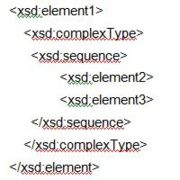](../Image/1.JPG "1.JPG")
* [Image:1.jpg](http://ontologydesignpatterns.org/wiki/index.php?title=Special:Upload&wpDestFile=1.jpg "Image:1.jpg")
* 
* [Image:2017-05-28-ESWC-Tutorial-Hammar.pdf](../Image/2017-05-28-ESWC-Tutorial-Hammar.pdf "Image:2017-05-28-ESWC-Tutorial-Hammar.pdf")
* [Image:2017-05-28-ESWC-Tutorial-HandsOn-Instructions.txt](../Image/2017-05-28-ESWC-Tutorial-HandsOn-Instructions.txt "Image:2017-05-28-ESWC-Tutorial-HandsOn-Instructions.txt")
* [Image:2018-10-08-ISWC-Tutorial-XDP-HandsOn-Instructions.txt](../Image/2018-10-08-ISWC-Tutorial-XDP-HandsOn-Instructions.txt "Image:2018-10-08-ISWC-Tutorial-XDP-HandsOn-Instructions.txt")
* [Image:2018-10-08-ISWC-Tutorial-XDP-HansOn-Instructions.txt](http://ontologydesignpatterns.org/wiki/index.php?title=Special:Upload&wpDestFile=2018-10-08-ISWC-Tutorial-XDP-HansOn-Instructions.txt "Image:2018-10-08-ISWC-Tutorial-XDP-HansOn-Instructions.txt")
* [Image:20181008 - ISWC 2018 Tutorial - Introduction to XD and XDP.pdf](../Image/20181008_-_ISWC_2018_Tutorial_-_Introduction_to_XD_and_XDP.pdf "Image:20181008 - ISWC 2018 Tutorial - Introduction to XD and XDP.pdf")
* [Image:2ndCFPatterns.txt](../Image/2ndCFPatterns.txt "Image:2ndCFPatterns.txt")
* 
* 
* 
* [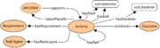](../Image/Activity3_new.png "Activity3 new.png")
* [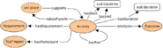](../Image/Activity3_small.png "Activity3 small.png")
* [Image:Activityspec op.pdf](../Image/Activityspec_op.pdf "Image:Activityspec op.pdf")
* [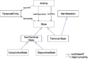](../Image/Activityspec_op.png "Activityspec op.png")
* [Image:Activityspec op1.pdf](../Image/Activityspec_op1.pdf "Image:Activityspec op1.pdf")
* 
* 
* 
* 
* [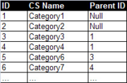](../Image/AdjacencyList_1.png "AdjacencyList 1.png")
* [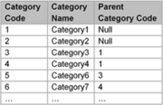](../Image/AdjacencyList.png "AdjacencyList.png")
* 
* [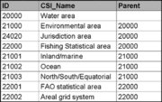](../Image/AdjacencyListWaterAreas.png "AdjacencyListWaterAreas.png")
* [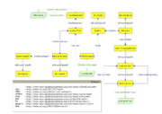](../Image/Affordance.png "Affordance.png")
* [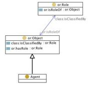](../Image/Agentrole.jpg "Agentrole.jpg")
* 
* [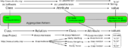](../Image/Aggregation-pattern.png "Aggregation-pattern.png")
* 
* [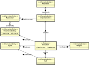](../Image/AlgorithmImplementationExecution.png "AlgorithmImplementationExecution.png")
* [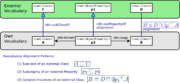](../Image/Alignment-odp.png "Alignment-odp.png")
* [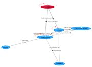](../Image/Aos.jpg "Aos.jpg")
* [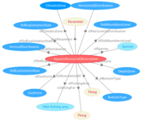](../Image/AquaticResourceObservation.png "AquaticResourceObservation.png")
* [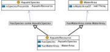](../Image/Aquaticresource.jpg "Aquaticresource.jpg")
* [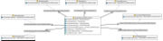](../Image/Aquaticresourceobservation.jpg "Aquaticresourceobservation.jpg")
* 
* [Image:Article.xml](../Image/Article.xml "Image:Article.xml")
* [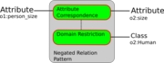](../Image/Attribute-domain-restriction.png "Attribute-domain-restriction.png")
* [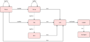](../Image/BDA_ODP_Diagram.png "BDA ODP Diagram.png")
* [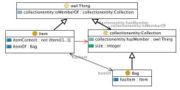](../Image/Bag.jpg "Bag.jpg")
* [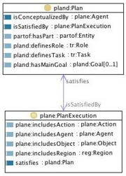](../Image/Basicplans.jpg "Basicplans.jpg")
* [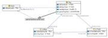](../Image/Basicplansdescription.jpg "Basicplansdescription.jpg")
* [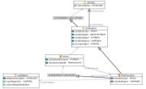](../Image/Basicplansexecution.jpg "Basicplansexecution.jpg")
* [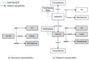](../Image/Before-after.png "Before-after.png")
* 
* 
* [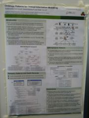](../Image/Bestposter2014.jpg "Bestposter2014.jpg")
* 
* [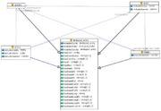](../Image/Biologicalentities.jpg "Biologicalentities.jpg")
* 
* [Image:BooksAndCDs.xml](../Image/BooksAndCDs.xml "Image:BooksAndCDs.xml")
* [Image:CFP-PDF.pdf](../Image/CFP-PDF.pdf "Image:CFP-PDF.pdf")
* [Image:CFPatterns1st.pdf](../Image/CFPatterns1st.pdf "Image:CFPatterns1st.pdf")
* [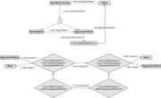](../Image/CP-SoA-01v1.jpg "CP-SoA-01v1.jpg")
* [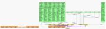](../Image/CaRePa_Ontology_image2.jpg "CaRePa Ontology image2.jpg")
* [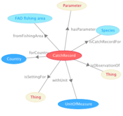](../Image/CatchRecord.png "CatchRecord.png")
* 
* 
* [Image:Chess-game-core-withevent.pdf](../Image/Chess-game-core-withevent.pdf "Image:Chess-game-core-withevent.pdf")
* [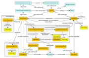](../Image/Chess-game-core-withevent.png "Chess-game-core-withevent.png")
* 
* 
* 
* [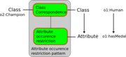](../Image/Class-by-attribute-occurence.png "Class-by-attribute-occurence.png")
* [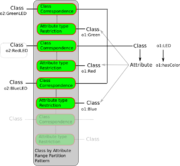](../Image/Class-by-attribute-range-partition.png "Class-by-attribute-range-partition.png")
* [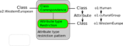](../Image/Class-by-attribute-type.png "Class-by-attribute-type.png")
* [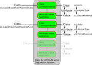](../Image/Class-by-attribute-value-disjunction.png "Class-by-attribute-value-disjunction.png")
* [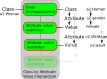](../Image/Class-by-attribute-value-intersection.png "Class-by-attribute-value-intersection.png")
* [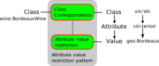](../Image/Class-by-attribute-value.png "Class-by-attribute-value.png")
* [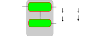](../Image/Class-by-attribute-value.svg "Class-by-attribute-value.svg")
* [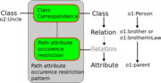](../Image/Class-by-path-attribute-occurence.png "Class-by-path-attribute-occurence.png")
* [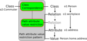](../Image/Class-by-path-attribute-value.png "Class-by-path-attribute-value.png")
* [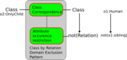](../Image/Class-by-relation-domain-exclusion.png "Class-by-relation-domain-exclusion.png")
* 
* [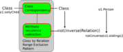](../Image/Class-by-relation-range-exclusion.png "Class-by-relation-range-exclusion.png")
* [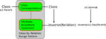](../Image/Class-by-relation-range.png "Class-by-relation-range.png")
* [Image:Class-equivalence.pdf](../Image/Class-equivalence.pdf "Image:Class-equivalence.pdf")
* 
* [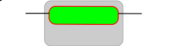](../Image/Class-equivalence.svg "Class-equivalence.svg")
* 
* [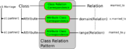](../Image/Class-relation.png "Class-relation.png")
* [Image:Class-ssubsuption.png](http://ontologydesignpatterns.org/wiki/index.php?title=Special:Upload&wpDestFile=Class-ssubsuption.png "Image:Class-ssubsuption.png")
* 
* 
* 
* [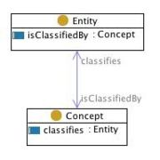](../Image/Classification.jpg "Classification.jpg")
* [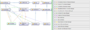](../Image/Codp.png "Codp.png")
* 
* [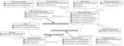](../Image/CommunicationEvent.jpg "CommunicationEvent.jpg")
* [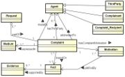](../Image/Complaint_UML.jpg "Complaint UML.jpg")
* [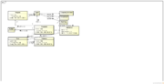](../Image/Complaint.png "Complaint.png")
* [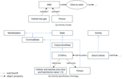](../Image/Complex_ex.png "Complex ex.png")
* [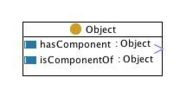](../Image/Componency.jpg "Componency.jpg")
* 
* [Image:ComputationalEnvironment.pdf](../Image/ComputationalEnvironment.pdf "Image:ComputationalEnvironment.pdf")
* 
* 
* [Image:ComputationalOntologiesD11.pdf](../Image/ComputationalOntologiesD11.pdf "Image:ComputationalOntologiesD11.pdf")
* 
* 
* 
* 
* 
* [Image:ContentDesignPatterns.pdf](../Image/ContentDesignPatterns.pdf "Image:ContentDesignPatterns.pdf")
* 
* 
* 
* 
* 
* 
* 
* [Image:CybersecOnotology.xml](../Image/CybersecOnotology.xml "Image:CybersecOnotology.xml")
* 
* [Image:DC 1.jape](../Image/DC_1.jape "Image:DC 1.jape")
* [Image:DP 1.jape](../Image/DP_1.jape "Image:DP 1.jape")
* [Image:DP 2.jape](../Image/DP_2.jape "Image:DP 2.jape")
* 
* 
* 
* 
* 
* 
* 
* 
* 
* 
* 
* 
* 
* 
* 
* 
* 
* 
* 
* [Image:Djedidi LOP1 WOP09.pdf](../Image/Djedidi_LOP1_WOP09.pdf "Image:Djedidi LOP1 WOP09.pdf")
* [Image:Djedidi LOP2 WOP09.pdf](../Image/Djedidi_LOP2_WOP09.pdf "Image:Djedidi LOP2 WOP09.pdf")
* 
* 
* 
* [Image:EQ 1.jape](../Image/EQ_1.jape "Image:EQ 1.jape")
* [Image:ESWC 2017 ModularOntologies lawrynowicz-kowalczuk.pdf](../Image/ESWC_2017_ModularOntologies_lawrynowicz-kowalczuk.pdf "Image:ESWC 2017 ModularOntologies lawrynowicz-kowalczuk.pdf")
* 
* 
* [Image:Edew.png](http://ontologydesignpatterns.org/wiki/index.php?title=Special:Upload&wpDestFile=Edew.png "Image:Edew.png")
* 
* 
* 
* 
* 
* 
* 
* 
* 
* 
* 
* 
* 
* 
* 
* 
* 
* 
* 
* [Image:Facet normalisation odp prot4x n3.txt](../Image/Facet_normalisation_odp_prot4x_n3.txt "Image:Facet normalisation odp prot4x n3.txt")
* 
* 
* 
* 
* 
* 
* 
* 
* 
* 
* 
* 
* 
* 
* 
* 
* 
* 
* 
* 
* 
* 
* 
* 
* 
* 
* 
* [Image:Http://Not applicable for this refactoring pattern](http://ontologydesignpatterns.org/wiki/index.php?title=Special:Upload&wpDestFile=Http://Not_applicable_for_this_refactoring_pattern "Image:Http://Not applicable for this refactoring pattern")
* [Image:Http://japeCodeLink](http://ontologydesignpatterns.org/wiki/index.php?title=Special:Upload&wpDestFile=Http://japeCodeLink "Image:Http://japeCodeLink")
* [Image:Http://ontologydesignpatterns.org/wiki/Image:Maz.jpg](http://ontologydesignpatterns.org/wiki/index.php?title=Special:Upload&wpDestFile=Http://ontologydesignpatterns.org/wiki/Image:Maz.jpg "Image:Http://ontologydesignpatterns.org/wiki/Image:Maz.jpg")
* [Image:Http://www.cs.man.ac.uk/~iannonel/images/Me.JPG](http://ontologydesignpatterns.org/wiki/index.php?title=Special:Upload&wpDestFile=Http://www.cs.man.ac.uk/%7Eiannonel/images/Me.JPG "Image:Http://www.cs.man.ac.uk/~iannonel/images/Me.JPG")
* [Image:Http://www.ict.csiro.au/staff/laurent.lefort/laurent.lefort.jpg](http://ontologydesignpatterns.org/wiki/index.php?title=Special:Upload&wpDestFile=Http://www.ict.csiro.au/staff/laurent.lefort/laurent.lefort.jpg "Image:Http://www.ict.csiro.au/staff/laurent.lefort/laurent.lefort.jpg")
* [Image:Https://en.gravatar.com/userimage/10836152/067d5c0d23cb7d2c014739bde319ad5a.png](http://ontologydesignpatterns.org/wiki/index.php?title=Special:Upload&wpDestFile=Https://en.gravatar.com/userimage/10836152/067d5c0d23cb7d2c014739bde319ad5a.png "Image:Https://en.gravatar.com/userimage/10836152/067d5c0d23cb7d2c014739bde319ad5a.png")
* [Image:Https://www.facebook.com/photo.php?fbid=10201043033145907&set=a.10201042991104856.1073741831.1470137125&type=1&permPage=1](http://ontologydesignpatterns.org/wiki/index.php?title=Special:Upload&wpDestFile=Https://www.facebook.com/photo.php%3Ffbid%3D10201043033145907%26set%3Da.10201042991104856.1073741831.1470137125%26type%3D1%26permPage%3D1 "Image:Https://www.facebook.com/photo.php?fbid=10201043033145907&set=a.10201042991104856.1073741831.1470137125&type=1&permPage=1")
* 
* [Image:ISWC 2016 Tutorial - Documenting and evaluating ODPs.pdf](../Image/ISWC_2016_Tutorial_-_Documenting_and_evaluating_ODPs.pdf "Image:ISWC 2016 Tutorial - Documenting and evaluating ODPs.pdf")
* [Image:ISWC 2016 Tutorial - Introduction to XD and XDP.pdf](../Image/ISWC_2016_Tutorial_-_Introduction_to_XD_and_XDP.pdf "Image:ISWC 2016 Tutorial - Introduction to XD and XDP.pdf")
* [Image:ISWC 2016 Tutorial Overview.txt](../Image/ISWC_2016_Tutorial_Overview.txt "Image:ISWC 2016 Tutorial Overview.txt")
* [Image:ISWC 2018 patterns tutorial part 3.pdf](../Image/ISWC_2018_patterns_tutorial_part_3.pdf "Image:ISWC 2018 patterns tutorial part 3.pdf")
* [Image:Image:903449 10201057254421430 1786989989 o.jpg](http://ontologydesignpatterns.org/wiki/index.php?title=Special:Upload&wpDestFile=Image:903449_10201057254421430_1786989989_o.jpg "Image:Image:903449 10201057254421430 1786989989 o.jpg")
* [Image:Image:CyclisSubClassOf.png](http://ontologydesignpatterns.org/wiki/index.php?title=Special:Upload&wpDestFile=Image:CyclisSubClassOf.png "Image:Image:CyclisSubClassOf.png")
* [Image:Image:EquivalentClassesAxiom.png](http://ontologydesignpatterns.org/wiki/index.php?title=Special:Upload&wpDestFile=Image:EquivalentClassesAxiom.png "Image:Image:EquivalentClassesAxiom.png")
* 
* 
* [Image:Info locked.svg](http://ontologydesignpatterns.org/wiki/index.php?title=Special:Upload&wpDestFile=Info_locked.svg "Image:Info locked.svg")
* 
* 
* 
* [Image:Interest all.pdf](../Image/Interest_all.pdf "Image:Interest all.pdf")
* 
* [Image:Internet business logic in a nutshell.pdf](../Image/Internet_business_logic_in_a_nutshell.pdf "Image:Internet business logic in a nutshell.pdf")
* 
* 
* 
* 
* 
* [Image:JapeCode.pdf](http://ontologydesignpatterns.org/wiki/index.php?title=Special:Upload&wpDestFile=JapeCode.pdf "Image:JapeCode.pdf")
* 
* 
* 
* 
* [Image:Krisnadhi-slides.pdf](../Image/Krisnadhi-slides.pdf "Image:Krisnadhi-slides.pdf")
* 
* [Image:LO 1.jape](../Image/LO_1.jape "Image:LO 1.jape")
* 
* 
* [Image:Languages.pdf](../Image/Languages.pdf "Image:Languages.pdf")
* 
* [Image:Legend.pdf](http://ontologydesignpatterns.org/wiki/index.php?title=Special:Upload&wpDestFile=Legend.pdf "Image:Legend.pdf")
* 
* 
* 
* 
* 
* 
* 
* 
* 
* 
* 
* 
* 
* [Image:LoSe ODP Vis.pdf](../Image/LoSe_ODP_Vis.pdf "Image:LoSe ODP Vis.pdf")
* 
* 
* 
* 
* 
* 
* [Image:Material-transformation.pdf](../Image/Material-transformation.pdf "Image:Material-transformation.pdf")
* 
* 
* 
* 
* 
* 
* [Image:Minutes170223 short.txt](../Image/Minutes170223_short.txt "Image:Minutes170223 short.txt")
* 
* 
* 
* 
* 
* 
* 
* [Image:Nary-relation.pdf](../Image/Nary-relation.pdf "Image:Nary-relation.pdf")
* 
* 
* 
* 
* 
* 
* 
* 
* 
* 
* 
* 
* [Image:Not applicable for refactoring patterns](http://ontologydesignpatterns.org/wiki/index.php?title=Special:Upload&wpDestFile=Not_applicable_for_refactoring_patterns "Image:Not applicable for refactoring patterns")
* [Image:Not applicable for this refactoring pattern](http://ontologydesignpatterns.org/wiki/index.php?title=Special:Upload&wpDestFile=Not_applicable_for_this_refactoring_pattern "Image:Not applicable for this refactoring pattern")
* 
* 
* 
* 
* 
* 
* 
* 
* 
* 
* 
* 
* 
* [Image:ODPA-approved-charter.pdf](../Image/ODPA-approved-charter.pdf "Image:ODPA-approved-charter.pdf")
* 
* 
* [Image:ODPChanges2009-06.pdf](../Image/ODPChanges2009-06.pdf "Image:ODPChanges2009-06.pdf")
* 
* 
* 
* 
* 
* 
* 
* [Image:OP 1.jape](../Image/OP_1.jape "Image:OP 1.jape")
* [Image:OP DP PW 1.jape](../Image/OP_DP_PW_1.jape "Image:OP DP PW 1.jape")
* [Image:OP UR 1 2.jape](../Image/OP_UR_1_2.jape "Image:OP UR 1 2.jape")
* [Image:OP UR 1.jape](../Image/OP_UR_1.jape "Image:OP UR 1.jape")
* 
* [Image:OR 1.jape](../Image/OR_1.jape "Image:OR 1.jape")
* 
* 
* 
* 
* [Image:OccupationsOntology.pdf](../Image/OccupationsOntology.pdf "Image:OccupationsOntology.pdf")
* 
* 
* 
* 
* 
* 
* 
* 
* 
* 
* 
* [Image:Ontology.pdf](../Image/Ontology.pdf "Image:Ontology.pdf")
* 
* [Image:OntologyAndData.pdf](../Image/OntologyAndData.pdf "Image:OntologyAndData.pdf")
* 
* 
* [Image:Optypes.jpg](http://ontologydesignpatterns.org/wiki/index.php?title=Special:Upload&wpDestFile=Optypes.jpg "Image:Optypes.jpg")
* [Image:PA 1.jape](../Image/PA_1.jape "Image:PA 1.jape")
* [Image:PW 1.jape](../Image/PW_1.jape "Image:PW 1.jape")
* [Image:PW 2.jape](../Image/PW_2.jape "Image:PW 2.jape")
* [Image:PW 3.jape](../Image/PW_3.jape "Image:PW 3.jape")
* [Image:PW 5.jape](../Image/PW_5.jape "Image:PW 5.jape")
* [Image:Pap1.pdf](../Image/Pap1.pdf "Image:Pap1.pdf")
* [Image:Pap3.pdf](../Image/Pap3.pdf "Image:Pap3.pdf")
* [Image:Pap4.pdf](../Image/Pap4.pdf "Image:Pap4.pdf")
* [Image:Pap5.pdf](../Image/Pap5.pdf "Image:Pap5.pdf")
* [Image:Paper 12.pdf](../Image/Paper_12.pdf "Image:Paper 12.pdf")
* [Image:Paper 13.pdf](../Image/Paper_13.pdf "Image:Paper 13.pdf")
* [Image:Paper 14.pdf](../Image/Paper_14.pdf "Image:Paper 14.pdf")
* [Image:Paper 4.pdf](../Image/Paper_4.pdf "Image:Paper 4.pdf")
* [Image:Paper 5.pdf](../Image/Paper_5.pdf "Image:Paper 5.pdf")
* [Image:Paper 6.pdf](../Image/Paper_6.pdf "Image:Paper 6.pdf")
* [Image:Paper 7.pdf](../Image/Paper_7.pdf "Image:Paper 7.pdf")
* [Image:Paper 8 update.pdf](../Image/Paper_8_update.pdf "Image:Paper 8 update.pdf")
* [Image:Paper 8.pdf](../Image/Paper_8.pdf "Image:Paper 8.pdf")
* [Image:Paper-01.pdf](../Image/Paper-01.pdf "Image:Paper-01.pdf")
* [Image:Paper-02.pdf](../Image/Paper-02.pdf "Image:Paper-02.pdf")
* [Image:Paper-03.pdf](../Image/Paper-03.pdf "Image:Paper-03.pdf")
* [Image:Paper-04.pdf](../Image/Paper-04.pdf "Image:Paper-04.pdf")
* [Image:Paper-05.pdf](../Image/Paper-05.pdf "Image:Paper-05.pdf")
* [Image:Paper-06.pdf](../Image/Paper-06.pdf "Image:Paper-06.pdf")
* [Image:Paper-07.pdf](../Image/Paper-07.pdf "Image:Paper-07.pdf")
* [Image:Paper-08.pdf](../Image/Paper-08.pdf "Image:Paper-08.pdf")
* [Image:Paper-09.pdf](../Image/Paper-09.pdf "Image:Paper-09.pdf")
* [Image:Paper-10.pdf](../Image/Paper-10.pdf "Image:Paper-10.pdf")
* [Image:Paper-11.pdf](../Image/Paper-11.pdf "Image:Paper-11.pdf")
* 
* 
* 
* 
* 
* 
* 
* 
* [Image:PathEnumeration.pdf](../Image/PathEnumeration.pdf "Image:PathEnumeration.pdf")
* 
* [Image:PathEnumerationOccupations.pdf](../Image/PathEnumerationOccupations.pdf "Image:PathEnumerationOccupations.pdf")
* 
* 
* 
* [Image:Pattern.pdf](../Image/Pattern.pdf "Image:Pattern.pdf")
* [Image:PatternBasedDesign.pdf](../Image/PatternBasedDesign.pdf "Image:PatternBasedDesign.pdf")
* 
* 
* 
* 
* 
* 
* 
* 
* 
* 
* 
* 
* 
* 
* 
* 
* 
* 
* 
* 
* 
* 
* 
* 
* 
* 
* 
* 
* [Image:RecordbasedtermbasedOntology.png](http://ontologydesignpatterns.org/wiki/index.php?title=Special:Upload&wpDestFile=RecordbasedtermbasedOntology.png "Image:RecordbasedtermbasedOntology.png")
* [Image:RecordbasedtermbasedOntologyETT.png](http://ontologydesignpatterns.org/wiki/index.php?title=Special:Upload&wpDestFile=RecordbasedtermbasedOntologyETT.png "Image:RecordbasedtermbasedOntologyETT.png")
* 
* 
* 
* 
* 
* 
* 
* 
* [Image:ReengineeringResources.pdf](../Image/ReengineeringResources.pdf "Image:ReengineeringResources.pdf")
* 
* 
* 
* 
* 
* 
* 
* 
* 
* 
* 
* 
* 
* 
* 
* 
* 
* 
* 
* 
* 
* [Image:Roehl-Jansen Disposition.pdf](../Image/Roehl-Jansen_Disposition.pdf "Image:Roehl-Jansen Disposition.pdf")
* 
* [Image:SC 1 2.jape](../Image/SC_1_2.jape "Image:SC 1 2.jape")
* [Image:SC 1.jape](../Image/SC_1.jape "Image:SC 1.jape")
* [Image:SC 1.txt](http://ontologydesignpatterns.org/wiki/index.php?title=Special:Upload&wpDestFile=SC_1.txt "Image:SC 1.txt")
* [Image:SC 3.jape](../Image/SC_3.jape "Image:SC 3.jape")
* [Image:SC 4.jape](../Image/SC_4.jape "Image:SC 4.jape")
* [Image:SC 5.jape](../Image/SC_5.jape "Image:SC 5.jape")
* [Image:SC De 1.jape](../Image/SC_De_1.jape "Image:SC De 1.jape")
* [Image:SC De 2.jape](../Image/SC_De_2.jape "Image:SC De 2.jape")
* [Image:SC De 3.jape](../Image/SC_De_3.jape "Image:SC De 3.jape")
* [Image:SC De 4.jape](../Image/SC_De_4.jape "Image:SC De 4.jape")
* [Image:SC Di EC 2.jape](../Image/SC_Di_EC_2.jape "Image:SC Di EC 2.jape")
* [Image:SC Di EC 3.jape](../Image/SC_Di_EC_3.jape "Image:SC Di EC 3.jape")
* [Image:SC Di EC 4 5.jape](../Image/SC_Di_EC_4_5.jape "Image:SC Di EC 4 5.jape")
* [Image:SC Di EC 4.jape](../Image/SC_Di_EC_4.jape "Image:SC Di EC 4.jape")
* [Image:SC PW 1.jape](../Image/SC_PW_1.jape "Image:SC PW 1.jape")
* [Image:SC PW 2.jape](../Image/SC_PW_2.jape "Image:SC PW 2.jape")
* [Image:SC1 1.jape](http://ontologydesignpatterns.org/wiki/index.php?title=Special:Upload&wpDestFile=SC1_1.jape "Image:SC1 1.jape")
* 
* 
* 
* 
* 
* 
* [.png).png).png).png/180px-Screenshot_(21).png)](../Image/Screenshot_(21).png).png.md).png.md).png.html "Screenshot (21).png")
* 
* 
* 
* 
* 
* 
* 
* 
* 
* 
* 
* 
* 
* 
* 
* 
* 
* 
* 
* [Image:StlabLogo.png](http://ontologydesignpatterns.org/wiki/index.php?title=Special:Upload&wpDestFile=StlabLogo.png "Image:StlabLogo.png")
* 
* 
* [Image:Student](http://ontologydesignpatterns.org/wiki/index.php?title=Special:Upload&wpDestFile=Student "Image:Student")
* 
* 
* 
* 
* 
* 
* 
* 
* 
* [… further results](http://ontologydesignpatterns.org/wiki/Special:Ask/-5B-5BImage:%2B-5D-5D/format%3Dul "Special:Ask/-5B-5BImage:+-5D-5D/format=ul")

Retrieved from "[http://ontologydesignpatterns.org/wiki/Community:Images](../Community/Images)"