* 
* [Image:1.jpg](http://ontologydesignpatterns.org/wiki/index.php?title=Special:Upload&wpDestFile=1.jpg "Image:1.jpg")
* 
* [Image:2017-05-28-ESWC-Tutorial-Hammar.pdf](../Image/2017-05-28-ESWC-Tutorial-Hammar.pdf.md "Image:2017-05-28-ESWC-Tutorial-Hammar.pdf")
* [Image:2017-05-28-ESWC-Tutorial-HandsOn-Instructions.txt](../Image/2017-05-28-ESWC-Tutorial-HandsOn-Instructions.txt.md "Image:2017-05-28-ESWC-Tutorial-HandsOn-Instructions.txt")
* [Image:2018-10-08-ISWC-Tutorial-XDP-HandsOn-Instructions.txt](../Image/2018-10-08-ISWC-Tutorial-XDP-HandsOn-Instructions.txt.md "Image:2018-10-08-ISWC-Tutorial-XDP-HandsOn-Instructions.txt")
* [Image:2018-10-08-ISWC-Tutorial-XDP-HansOn-Instructions.txt](http://ontologydesignpatterns.org/wiki/index.php?title=Special:Upload&wpDestFile=2018-10-08-ISWC-Tutorial-XDP-HansOn-Instructions.txt "Image:2018-10-08-ISWC-Tutorial-XDP-HansOn-Instructions.txt")
* [Image:20181008 - ISWC 2018 Tutorial - Introduction to XD and XDP.pdf](../Image/20181008_-_ISWC_2018_Tutorial_-_Introduction_to_XD_and_XDP.pdf.md "Image:20181008 - ISWC 2018 Tutorial - Introduction to XD and XDP.pdf")
* [Image:2ndCFPatterns.txt](../Image/2ndCFPatterns.txt.md "Image:2ndCFPatterns.txt")
* 
* 
* [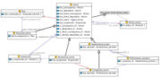](../Image/Action.jpg.md "Action.jpg")
* 
* 
* [Image:Activityspec op.pdf](../Image/Activityspec_op.pdf.md "Image:Activityspec op.pdf")
* 
* [Image:Activityspec op1.pdf](../Image/Activityspec_op1.pdf.md "Image:Activityspec op1.pdf")
* 
* 
* [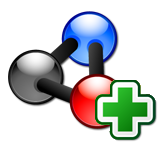](../Image/AddPattern.png.md "AddPattern.png")
* 
* 
* 
* [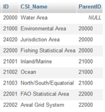](../Image/AdjacencyListWaterAreas_1.png.md "AdjacencyListWaterAreas 1.png")
* 
* 
* 
* 
* 
* [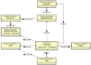](../Image/AlgorithmImplementationExecution_ver2.png.md "AlgorithmImplementationExecution ver2.png")
* 
* 
* 
* 
* 
* 
* 
* [Image:Article.xml](../Image/Article.xml.md "Image:Article.xml")
* 
* 
* 
* 
* 
* 
* 
* 
* 
* 
* 
* 
* 
* [Image:BooksAndCDs.xml](../Image/BooksAndCDs.xml.md "Image:BooksAndCDs.xml")
* [Image:CFP-PDF.pdf](../Image/CFP-PDF.pdf.md "Image:CFP-PDF.pdf")
* [Image:CFPatterns1st.pdf](../Image/CFPatterns1st.pdf.md "Image:CFPatterns1st.pdf")
* 
* 
* 
* 
* 
* [Image:Chess-game-core-withevent.pdf](../Image/Chess-game-core-withevent.pdf.md "Image:Chess-game-core-withevent.pdf")
* 
* 
* 
* [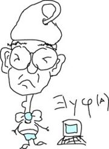](../Image/ClaraDrawing.jpg.md "ClaraDrawing.jpg")
* 
* 
* 
* 
* 
* 
* 
* 
* 
* 
* [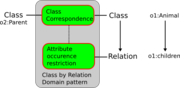](../Image/Class-by-relation-domain.png.md "Class-by-relation-domain.png")
* 
* 
* [Image:Class-equivalence.pdf](../Image/Class-equivalence.pdf.md "Image:Class-equivalence.pdf")
* 
* 
* 
* 
* [Image:Class-ssubsuption.png](http://ontologydesignpatterns.org/wiki/index.php?title=Special:Upload&wpDestFile=Class-ssubsuption.png "Image:Class-ssubsuption.png")
* 
* 
* 
* 
* 
* 
* 
* 
* 
* 
* 
* 
* [Image:ComputationalEnvironment.pdf](../Image/ComputationalEnvironment.pdf.md "Image:ComputationalEnvironment.pdf")
* 
* 
* [Image:ComputationalOntologiesD11.pdf](../Image/ComputationalOntologiesD11.pdf.md "Image:ComputationalOntologiesD11.pdf")
* 
* 
* 
* 
* 
* [Image:ContentDesignPatterns.pdf](../Image/ContentDesignPatterns.pdf.md "Image:ContentDesignPatterns.pdf")
* 
* 
* 
* 
* 
* 
* 
* [Image:CybersecOnotology.xml](../Image/CybersecOnotology.xml.md "Image:CybersecOnotology.xml")
* [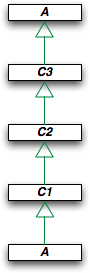](../Image/CyclisSubClassOf.png.md "CyclisSubClassOf.png")
* [Image:DC 1.jape](../Image/DC_1.jape.md "Image:DC 1.jape")
* [Image:DP 1.jape](../Image/DP_1.jape.md "Image:DP 1.jape")
* [Image:DP 2.jape](../Image/DP_2.jape.md "Image:DP 2.jape")
* 
* 
* 
* 
* 
* 
* 
* 
* 
* 
* 
* 
* 
* 
* 
* 
* 
* 
* 
* [Image:Djedidi LOP1 WOP09.pdf](../Image/Djedidi_LOP1_WOP09.pdf.md "Image:Djedidi LOP1 WOP09.pdf")
* [Image:Djedidi LOP2 WOP09.pdf](../Image/Djedidi_LOP2_WOP09.pdf.md "Image:Djedidi LOP2 WOP09.pdf")
* 
* 
* 
* [Image:EQ 1.jape](../Image/EQ_1.jape.md "Image:EQ 1.jape")
* [Image:ESWC 2017 ModularOntologies lawrynowicz-kowalczuk.pdf](../Image/ESWC_2017_ModularOntologies_lawrynowicz-kowalczuk.pdf.md "Image:ESWC 2017 ModularOntologies lawrynowicz-kowalczuk.pdf")
* 
* 
* [Image:Edew.png](http://ontologydesignpatterns.org/wiki/index.php?title=Special:Upload&wpDestFile=Edew.png "Image:Edew.png")
* 
* [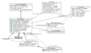](../Image/Ep.png.md "Ep.png")
* 
* 
* 
* 
* 
* 
* 
* 
* 
* 
* 
* 
* 
* 
* 
* 
* 
* [Image:Facet normalisation odp prot4x n3.txt](../Image/Facet_normalisation_odp_prot4x_n3.txt.md "Image:Facet normalisation odp prot4x n3.txt")
* 
* 
* 
* 
* 
* 
* 
* 
* 
* 
* 
* 
* 
* 
* 
* 
* 
* 
* 
* 
* 
* 
* 
* 
* 
* 
* 
* [Image:Http://Not applicable for this refactoring pattern](http://ontologydesignpatterns.org/wiki/index.php?title=Special:Upload&wpDestFile=Http://Not_applicable_for_this_refactoring_pattern "Image:Http://Not applicable for this refactoring pattern")
* [Image:Http://japeCodeLink](http://ontologydesignpatterns.org/wiki/index.php?title=Special:Upload&wpDestFile=Http://japeCodeLink "Image:Http://japeCodeLink")
* [Image:Http://ontologydesignpatterns.org/wiki/Image:Maz.jpg](http://ontologydesignpatterns.org/wiki/index.php?title=Special:Upload&wpDestFile=Http://ontologydesignpatterns.org/wiki/Image:Maz.jpg "Image:Http://ontologydesignpatterns.org/wiki/Image:Maz.jpg")
* [Image:Http://www.cs.man.ac.uk/~iannonel/images/Me.JPG](http://ontologydesignpatterns.org/wiki/index.php?title=Special:Upload&wpDestFile=Http://www.cs.man.ac.uk/%7Eiannonel/images/Me.JPG "Image:Http://www.cs.man.ac.uk/~iannonel/images/Me.JPG")
* [Image:Http://www.ict.csiro.au/staff/laurent.lefort/laurent.lefort.jpg](http://ontologydesignpatterns.org/wiki/index.php?title=Special:Upload&wpDestFile=Http://www.ict.csiro.au/staff/laurent.lefort/laurent.lefort.jpg "Image:Http://www.ict.csiro.au/staff/laurent.lefort/laurent.lefort.jpg")
* [Image:Https://en.gravatar.com/userimage/10836152/067d5c0d23cb7d2c014739bde319ad5a.png](http://ontologydesignpatterns.org/wiki/index.php?title=Special:Upload&wpDestFile=Https://en.gravatar.com/userimage/10836152/067d5c0d23cb7d2c014739bde319ad5a.png "Image:Https://en.gravatar.com/userimage/10836152/067d5c0d23cb7d2c014739bde319ad5a.png")
* [Image:Https://www.facebook.com/photo.php?fbid=10201043033145907&set=a.10201042991104856.1073741831.1470137125&type=1&permPage=1](http://ontologydesignpatterns.org/wiki/index.php?title=Special:Upload&wpDestFile=Https://www.facebook.com/photo.php%3Ffbid%3D10201043033145907%26set%3Da.10201042991104856.1073741831.1470137125%26type%3D1%26permPage%3D1 "Image:Https://www.facebook.com/photo.php?fbid=10201043033145907&set=a.10201042991104856.1073741831.1470137125&type=1&permPage=1")
* 
* [Image:ISWC 2016 Tutorial - Documenting and evaluating ODPs.pdf](../Image/ISWC_2016_Tutorial_-_Documenting_and_evaluating_ODPs.pdf.md "Image:ISWC 2016 Tutorial - Documenting and evaluating ODPs.pdf")
* [Image:ISWC 2016 Tutorial - Introduction to XD and XDP.pdf](../Image/ISWC_2016_Tutorial_-_Introduction_to_XD_and_XDP.pdf.md "Image:ISWC 2016 Tutorial - Introduction to XD and XDP.pdf")
* [Image:ISWC 2016 Tutorial Overview.txt](../Image/ISWC_2016_Tutorial_Overview.txt.md "Image:ISWC 2016 Tutorial Overview.txt")
* [Image:ISWC 2018 patterns tutorial part 3.pdf](../Image/ISWC_2018_patterns_tutorial_part_3.pdf.md "Image:ISWC 2018 patterns tutorial part 3.pdf")
* [Image:Image:903449 10201057254421430 1786989989 o.jpg](http://ontologydesignpatterns.org/wiki/index.php?title=Special:Upload&wpDestFile=Image:903449_10201057254421430_1786989989_o.jpg "Image:Image:903449 10201057254421430 1786989989 o.jpg")
* [Image:Image:CyclisSubClassOf.png](http://ontologydesignpatterns.org/wiki/index.php?title=Special:Upload&wpDestFile=Image:CyclisSubClassOf.png "Image:Image:CyclisSubClassOf.png")
* [Image:Image:EquivalentClassesAxiom.png](http://ontologydesignpatterns.org/wiki/index.php?title=Special:Upload&wpDestFile=Image:EquivalentClassesAxiom.png "Image:Image:EquivalentClassesAxiom.png")
* 
* 
* [Image:Info locked.svg](http://ontologydesignpatterns.org/wiki/index.php?title=Special:Upload&wpDestFile=Info_locked.svg "Image:Info locked.svg")
* 
* 
* 
* [Image:Interest all.pdf](../Image/Interest_all.pdf.md "Image:Interest all.pdf")
* 
* [Image:Internet business logic in a nutshell.pdf](../Image/Internet_business_logic_in_a_nutshell.pdf.md "Image:Internet business logic in a nutshell.pdf")
* 
* 
* 
* 
* 
* [Image:JapeCode.pdf](http://ontologydesignpatterns.org/wiki/index.php?title=Special:Upload&wpDestFile=JapeCode.pdf "Image:JapeCode.pdf")
* 
* 
* 
* 
* [Image:Krisnadhi-slides.pdf](../Image/Krisnadhi-slides.pdf.md "Image:Krisnadhi-slides.pdf")
* 
* [Image:LO 1.jape](../Image/LO_1.jape.md "Image:LO 1.jape")
* 
* 
* [Image:Languages.pdf](../Image/Languages.pdf.md "Image:Languages.pdf")
* 
* [Image:Legend.pdf](http://ontologydesignpatterns.org/wiki/index.php?title=Special:Upload&wpDestFile=Legend.pdf "Image:Legend.pdf")
* 
* 
* 
* 
* 
* 
* 
* 
* 
* 
* 
* 
* 
* [Image:LoSe ODP Vis.pdf](../Image/LoSe_ODP_Vis.pdf.md "Image:LoSe ODP Vis.pdf")
* 
* 
* 
* 
* 
* 
* [Image:Material-transformation.pdf](../Image/Material-transformation.pdf.md "Image:Material-transformation.pdf")
* 
* 
* 
* 
* 
* 
* [Image:Minutes170223 short.txt](../Image/Minutes170223_short.txt.md "Image:Minutes170223 short.txt")
* 
* 
* 
* 
* 
* 
* 
* [Image:Nary-relation.pdf](../Image/Nary-relation.pdf.md "Image:Nary-relation.pdf")
* 
* 
* 
* 
* 
* 
* 
* 
* 
* 
* 
* 
* [Image:Not applicable for refactoring patterns](http://ontologydesignpatterns.org/wiki/index.php?title=Special:Upload&wpDestFile=Not_applicable_for_refactoring_patterns "Image:Not applicable for refactoring patterns")
* [Image:Not applicable for this refactoring pattern](http://ontologydesignpatterns.org/wiki/index.php?title=Special:Upload&wpDestFile=Not_applicable_for_this_refactoring_pattern "Image:Not applicable for this refactoring pattern")
* 
* 
* 
* 
* 
* 
* 
* 
* 
* 
* 
* 
* 
* [Image:ODPA-approved-charter.pdf](../Image/ODPA-approved-charter.pdf.md "Image:ODPA-approved-charter.pdf")
* 
* 
* [Image:ODPChanges2009-06.pdf](../Image/ODPChanges2009-06.pdf.md "Image:ODPChanges2009-06.pdf")
* 
* 
* 
* 
* [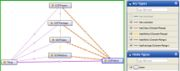](../Image/OOPMetrics.jpg.md "OOPMetrics.jpg")
* 
* 
* [Image:OP 1.jape](../Image/OP_1.jape.md "Image:OP 1.jape")
* [Image:OP DP PW 1.jape](../Image/OP_DP_PW_1.jape.md "Image:OP DP PW 1.jape")
* [Image:OP UR 1 2.jape](../Image/OP_UR_1_2.jape.md "Image:OP UR 1 2.jape")
* [Image:OP UR 1.jape](../Image/OP_UR_1.jape.md "Image:OP UR 1.jape")
* 
* [Image:OR 1.jape](../Image/OR_1.jape.md "Image:OR 1.jape")
* 
* 
* 
* 
* [Image:OccupationsOntology.pdf](../Image/OccupationsOntology.pdf.md "Image:OccupationsOntology.pdf")
* 
* 
* 
* 
* 
* 
* 
* [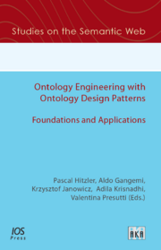](../Image/Odpcover.png.md "Odpcover.png")
* 
* 
* [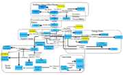](../Image/Ontology_strategy_design.png.md "Ontology strategy design.png")
* [Image:Ontology.pdf](../Image/Ontology.pdf.md "Image:Ontology.pdf")
* 
* [Image:OntologyAndData.pdf](../Image/OntologyAndData.pdf.md "Image:OntologyAndData.pdf")
* 
* 
* [Image:Optypes.jpg](http://ontologydesignpatterns.org/wiki/index.php?title=Special:Upload&wpDestFile=Optypes.jpg "Image:Optypes.jpg")
* [Image:PA 1.jape](../Image/PA_1.jape.md "Image:PA 1.jape")
* [Image:PW 1.jape](../Image/PW_1.jape.md "Image:PW 1.jape")
* [Image:PW 2.jape](../Image/PW_2.jape.md "Image:PW 2.jape")
* [Image:PW 3.jape](../Image/PW_3.jape.md "Image:PW 3.jape")
* [Image:PW 5.jape](../Image/PW_5.jape.md "Image:PW 5.jape")
* [Image:Pap1.pdf](../Image/Pap1.pdf.md "Image:Pap1.pdf")
* [Image:Pap3.pdf](../Image/Pap3.pdf.md "Image:Pap3.pdf")
* [Image:Pap4.pdf](../Image/Pap4.pdf.md "Image:Pap4.pdf")
* [Image:Pap5.pdf](../Image/Pap5.pdf.md "Image:Pap5.pdf")
* [Image:Paper 12.pdf](../Image/Paper_12.pdf.md "Image:Paper 12.pdf")
* [Image:Paper 13.pdf](../Image/Paper_13.pdf.md "Image:Paper 13.pdf")
* [Image:Paper 14.pdf](../Image/Paper_14.pdf.md "Image:Paper 14.pdf")
* [Image:Paper 4.pdf](../Image/Paper_4.pdf.md "Image:Paper 4.pdf")
* [Image:Paper 5.pdf](../Image/Paper_5.pdf.md "Image:Paper 5.pdf")
* [Image:Paper 6.pdf](../Image/Paper_6.pdf.md "Image:Paper 6.pdf")
* [Image:Paper 7.pdf](../Image/Paper_7.pdf.md "Image:Paper 7.pdf")
* [Image:Paper 8 update.pdf](../Image/Paper_8_update.pdf.md "Image:Paper 8 update.pdf")
* [Image:Paper 8.pdf](../Image/Paper_8.pdf.md "Image:Paper 8.pdf")
* [Image:Paper-01.pdf](../Image/Paper-01.pdf.md "Image:Paper-01.pdf")
* [Image:Paper-02.pdf](../Image/Paper-02.pdf.md "Image:Paper-02.pdf")
* [Image:Paper-03.pdf](../Image/Paper-03.pdf.md "Image:Paper-03.pdf")
* [Image:Paper-04.pdf](../Image/Paper-04.pdf.md "Image:Paper-04.pdf")
* [Image:Paper-05.pdf](../Image/Paper-05.pdf.md "Image:Paper-05.pdf")
* [Image:Paper-06.pdf](../Image/Paper-06.pdf.md "Image:Paper-06.pdf")
* [Image:Paper-07.pdf](../Image/Paper-07.pdf.md "Image:Paper-07.pdf")
* [Image:Paper-08.pdf](../Image/Paper-08.pdf.md "Image:Paper-08.pdf")
* [Image:Paper-09.pdf](../Image/Paper-09.pdf.md "Image:Paper-09.pdf")
* [Image:Paper-10.pdf](../Image/Paper-10.pdf.md "Image:Paper-10.pdf")
* [Image:Paper-11.pdf](../Image/Paper-11.pdf.md "Image:Paper-11.pdf")
* 
* 
* 
* 
* 
* 
* 
* 
* [Image:PathEnumeration.pdf](../Image/PathEnumeration.pdf.md "Image:PathEnumeration.pdf")
* 
* [Image:PathEnumerationOccupations.pdf](../Image/PathEnumerationOccupations.pdf.md "Image:PathEnumerationOccupations.pdf")
* 
* 
* 
* [Image:Pattern.pdf](../Image/Pattern.pdf.md "Image:Pattern.pdf")
* [Image:PatternBasedDesign.pdf](../Image/PatternBasedDesign.pdf.md "Image:PatternBasedDesign.pdf")
* 
* 
* [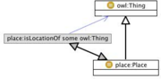](../Image/Place.png.md "Place.png")
* 
* 
* 
* 
* 
* 
* 
* 
* 
* 
* 
* 
* 
* 
* 
* 
* 
* 
* 
* 
* 
* 
* 
* 
* 
* [Image:RecordbasedtermbasedOntology.png](http://ontologydesignpatterns.org/wiki/index.php?title=Special:Upload&wpDestFile=RecordbasedtermbasedOntology.png "Image:RecordbasedtermbasedOntology.png")
* [Image:RecordbasedtermbasedOntologyETT.png](http://ontologydesignpatterns.org/wiki/index.php?title=Special:Upload&wpDestFile=RecordbasedtermbasedOntologyETT.png "Image:RecordbasedtermbasedOntologyETT.png")
* 
* 
* 
* 
* 
* 
* 
* 
* [Image:ReengineeringResources.pdf](../Image/ReengineeringResources.pdf.md "Image:ReengineeringResources.pdf")
* [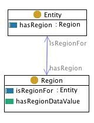](../Image/Region.jpg.md "Region.jpg")
* 
* 
* 
* 
* 
* 
* 
* [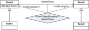](../Image/RelationbasedtermbasedOntology.png.md "RelationbasedtermbasedOntology.png")
* 
* 
* 
* 
* 
* 
* [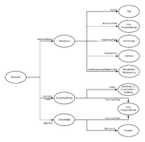](../Image/ResidentPattern.png.md "ResidentPattern.png")
* 
* 
* 
* 
* 
* [Image:Roehl-Jansen Disposition.pdf](../Image/Roehl-Jansen_Disposition.pdf.md "Image:Roehl-Jansen Disposition.pdf")
* [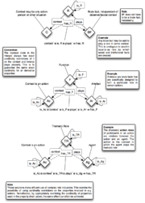](../Image/Role.png.md "Role.png")
* [Image:SC 1 2.jape](../Image/SC_1_2.jape.md "Image:SC 1 2.jape")
* [Image:SC 1.jape](../Image/SC_1.jape.md "Image:SC 1.jape")
* [Image:SC 1.txt](http://ontologydesignpatterns.org/wiki/index.php?title=Special:Upload&wpDestFile=SC_1.txt "Image:SC 1.txt")
* [Image:SC 3.jape](../Image/SC_3.jape.md "Image:SC 3.jape")
* [Image:SC 4.jape](../Image/SC_4.jape.md "Image:SC 4.jape")
* [Image:SC 5.jape](../Image/SC_5.jape.md "Image:SC 5.jape")
* [Image:SC De 1.jape](../Image/SC_De_1.jape.md "Image:SC De 1.jape")
* [Image:SC De 2.jape](../Image/SC_De_2.jape.md "Image:SC De 2.jape")
* [Image:SC De 3.jape](../Image/SC_De_3.jape.md "Image:SC De 3.jape")
* [Image:SC De 4.jape](../Image/SC_De_4.jape.md "Image:SC De 4.jape")
* [Image:SC Di EC 2.jape](../Image/SC_Di_EC_2.jape.md "Image:SC Di EC 2.jape")
* [Image:SC Di EC 3.jape](../Image/SC_Di_EC_3.jape.md "Image:SC Di EC 3.jape")
* [Image:SC Di EC 4 5.jape](../Image/SC_Di_EC_4_5.jape.md "Image:SC Di EC 4 5.jape")
* [Image:SC Di EC 4.jape](../Image/SC_Di_EC_4.jape.md "Image:SC Di EC 4.jape")
* [Image:SC PW 1.jape](../Image/SC_PW_1.jape.md "Image:SC PW 1.jape")
* [Image:SC PW 2.jape](../Image/SC_PW_2.jape.md "Image:SC PW 2.jape")
* [Image:SC1 1.jape](http://ontologydesignpatterns.org/wiki/index.php?title=Special:Upload&wpDestFile=SC1_1.jape "Image:SC1 1.jape")
* 
* 
* 
* 
* 
* 
* [.png).png).png/180px-Screenshot_(21).png)](../Image/Screenshot_(21).png.md).png.md).png.html "Screenshot (21).png")
* 
* 
* 
* 
* [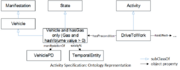](../Image/Simple_ex.png.md "Simple ex.png")
* 
* 
* 
* 
* 
* 
* 
* 
* 
* 
* 
* 
* 
* 
* [Image:StlabLogo.png](http://ontologydesignpatterns.org/wiki/index.php?title=Special:Upload&wpDestFile=StlabLogo.png "Image:StlabLogo.png")
* 
* 
* [Image:Student](http://ontologydesignpatterns.org/wiki/index.php?title=Special:Upload&wpDestFile=Student "Image:Student")
* [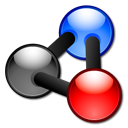](../Image/SubmitCP.png.md "SubmitCP.png")
* 
* 
* 
* 
* 
* 
* 
* 
* [ further results](http://ontologydesignpatterns.org/wiki/Special:Ask/-5B-5BImage:%2B-5D-5D/format%3Dul "Special:Ask/-5B-5BImage:+-5D-5D/format=ul")

Retrieved from "[http://ontologydesignpatterns.org/wiki/Community:Images](../Community/Images.md)"