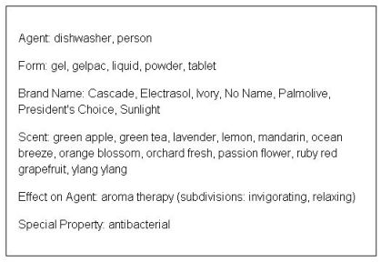

#  Multiple Alternative Classification Criteria

__Title:__ Multiple Alternative Classification Criteria.

Faceted Classification Scheme (FCS).

__Description:__ This modelling issue describes a specific, very recurrent modeling scenario in ontology development, subject to the vulnerability of ad-hoc modeling practices that could potentially lead to unexpected or undesirable results in ontology artifacts. 
The scenario consists of domain-specific concepts that can be represented according to multiple alternative classification criteria. 

__Diagram__

#  About

  

#  Additional information

To the best of our knowledge, guidelines for the conceptualization and representation of domain-specific concepts prone to be described based on multiple (potentially alternative) classification criteria, has not been explicitly considered in the context of ontology modeling for the Semantic Web.
General examples of domain-specific concepts that exhibit the characteristics described abound, going from a "bibliographic reference", (which could be classified according to several criteria such as "subject", "author", "publication venue", etc.); to a "toy" (which could be classified based on "suitable age", "brand", "subject type", etc.). 
The list of examples can go on. 
We have seen in our own experience that lack of specific design guidelines leaves ample room for conceptual errors when trying to develop a simple domain-specific ontology model for such concepts. 
For example, common mistakes when trying to represent these concepts and their classification criteria are to use subsumption relations between classes when in fact a part-of relation would be in order, or to use subsumption to model relationships that are outside OWL DL expressivity altogether.

Other examples of domain-specific concepts that can fit into the modeling scenario described are particularly interesting because they are used in well-known ontology development literature using OWL. 
They include: "Wine" [(Welty et al., 2004)](../Community/References/OWL_web_ontology_language_guide "Community:References/OWL web ontology language guide"), "Person" (in the context of family history relations) [(Krotzsch et al., 2009)](../Community/References/OWL_2_web_ontology_language_primer "Community:References/OWL 2 web ontology language primer"), or "Pizza" [(Horridge et al., 2009)](../Community/References/A_Practical_Guide_To_Building_OWL_Ontologies_Using_Protege_4_and_CO-ODE_Tools_Edition_1_2_2 "Community:References/A Practical Guide To Building OWL Ontologies Using Protege 4 and CO-ODE Tools Edition 1 2 2"). 
However, in none of them, they refer explicitly to the various classification criteria of the domain concept that are considered implicitly, nor attempt to represent these criteria explicitly in the respective ontology models developed.

This modeling issue refers to the conceptualization of a specific domain concept using a Faceted Classification Scheme (FCS).

A FCS is defined as: "a set of mutually exclusive and jointly exhaustive categories, each made by isolating one perspective on the items (a facet), that combine to completely describe all the objects in question, and which users can use, by searching and browsing, to find what they need" [(Denton, 2003)](../Community/References/How_to_Make_a_Faceted_Classification_and_Put_It_On_the_Web_2 "Community:References/How to Make a Faceted Classification and Put It On the Web 2").

The section __Diagram__ below presents an example of a FCS in the domain of "Dishwashing Detergent" from [(Denton, 2003)](../Community/References/How_to_Make_a_Faceted_Classification_and_Put_It_On_the_Web_2 "Community:References/How to Make a Faceted Classification and Put It On the Web 2").

A more detailed explanation of this modeling issue and the rationale of one proposed solution is presented in the paper: [(Rodriguez-Castro et al., 2010)](../Community/References/How_to_Reuse_a_Faceted_Classification_and_Put_it_on_the_Semantic_Web "Community:References/How to Reuse a Faceted Classification and Put it on the Semantic Web").

The OWL file in section __Proposed Solutions__ provides an OWL DL implementation of 
the example FCS in section __Diagram__ applying the [Normalization](../Submissions/Normalization "Submissions:Normalization") ODP as outlined in the paper mentioned.

#  References

[Add a reference](index.php@title=Odp%253AAdd_reference&subject=Community%253AMultiple+Alternative+Classification+Criteria.html "http://ontologydesignpatterns.org/wiki/index.php?title=Odp:Add_reference&subject=Community%3AMultiple+Alternative+Classification+Criteria")

* Matthew Horridge, Nick Drummond, Simon Jupp, Georgina Moulton, Robert Stevens. A Practical Guide To Building OWL Ontologies Using Protege 4 and CO-ODE Tools Edition 1.2. Technical report, The University Of Manchester, March 2009. [Documentation](http://owl.cs.manchester.ac.uk/tutorials/protegeowltutorial/resources/ProtegeOWLTutorialP4_v1_2.pdf "http://owl.cs.manchester.ac.uk/tutorials/protegeowltutorial/resources/ProtegeOWLTutorialP4_v1_2.pdf") | [reference page](../Community/References/A_Practical_Guide_To_Building_OWL_Ontologies_Using_Protege_4_and_CO-ODE_Tools_Edition_1_2_2 "Community:References/A Practical Guide To Building OWL Ontologies Using Protege 4 and CO-ODE Tools Edition 1 2 2")
* Denton, William. How to Make a Faceted Classification and Put It On the Web. Nov 2003. [Documentation](http://www.miskatonic.org/library/facet-web-howto.html "http://www.miskatonic.org/library/facet-web-howto.html") | [reference page](../Community/References/How_to_Make_a_Faceted_Classification_and_Put_It_On_the_Web_2 "Community:References/How to Make a Faceted Classification and Put It On the Web 2")
* Alan L. Rector. Modularisation of domain ontologies implemented in description logics and related formalisms including owl. In K-CAP '03: Proceedings of the 2nd international conference on Knowledge capture, pages 121{128, New York, NY, USA, 2003. ACM. [ISBN 1-58113-583-1](http://ontologydesignpatterns.org/wiki/Special:BookSources/1581135831). Documentation | [reference page](../Community/References/Modularisation_of_domain_ontologies_implemented_in_description_logics_and_related_formalisms_including_owl_2 "Community:References/Modularisation of domain ontologies implemented in description logics and related formalisms including owl 2")
* Rodriguez-Castro, B., Glaser, H. and Carr, L. (2010) How to Reuse a Faceted Classification and Put it on the Semantic Web. In: The 9th International Semantic Web Conference (ISWC), November 2010, Shanghai, China. [Documentation](http://eprints.ecs.soton.ac.uk/21488/ "http://eprints.ecs.soton.ac.uk/21488/") | [reference page](../Community/References/How_to_Reuse_a_Faceted_Classification_and_Put_it_on_the_Semantic_Web "Community:References/How to Reuse a Faceted Classification and Put it on the Semantic Web")
* Welty, C., McGuinness, D.L., Smith, M.K.: OWL web ontology language guide. W3C recommendation, W3C (February 2004). [Documentation](http://www.w3.org/TR/2004/REC-owl-guide-20040210/ "http://www.w3.org/TR/2004/REC-owl-guide-20040210/") | [reference page](../Community/References/OWL_web_ontology_language_guide "Community:References/OWL web ontology language guide")
* Krotzsch, M., Patel-Schneider, P.F., Rudolph, S., Hitzler, P., Parsia, B.: OWL 2 web ontology language primer. Technical report, W3C (October 2009). [Documentation](http://www.w3.org/TR/2009/REC-owl2-primer-20091027/ "http://www.w3.org/TR/2009/REC-owl2-primer-20091027/") | [reference page](../Community/References/OWL_2_web_ontology_language_primer "Community:References/OWL 2 web ontology language primer")

 [List of Modeling Issues](../Community/Main "Community:Main") | [Post a new modeling issue](../Community/PostModelingIssue "Community:PostModelingIssue") | [Add a comment in the discussion page](index.php@title=Odp%253AAdd_comment&target=Community_talk%253AMultiple_Alternative_Classification_Criteria.html#New_comment "http://ontologydesignpatterns.org/wiki/index.php?title=Odp:Add_comment&target=Community_talk:Multiple_Alternative_Classification_Criteria#New_comment")

Retrieved from "[http://ontologydesignpatterns.org/wiki/Community:Multiple\_Alternative\_Classification\_Criteria](../Community/Multiple_Alternative_Classification_Criteria)"
 [Categories](http://ontologydesignpatterns.org/wiki/Special:Categories "Special:Categories"): [ModelingIssue](../Category/ModelingIssue "Category:ModelingIssue") | [Submitted to event](../Category/Submitted_to_event "Category:Submitted to event")