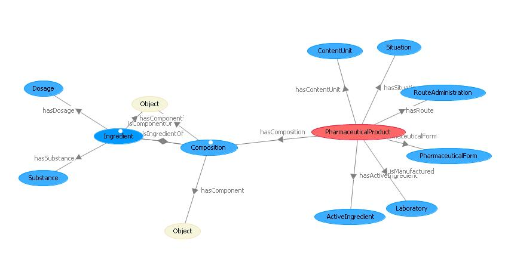

#  PharmaceuticalProducts Composition


__Title:__ Pharmaceutical Product Composition


__Description:__ The pharmaceutical products or drugs are chemical products composed by a set of ingredients (substances).


The ingredients are substances in a concrete dosage. 
The ingredients are divided in one main ingredient (mainly an active ingredient) and a set of excipients (other substances)
The drugs are uniques based on their concrete composition. 


I checked the Parts and Collections patterns, but I'm not pretty sure to use the Composition or Constituency in this case 


__Diagram__
_(this article has no graphical representation)_


#  About


  


#  Additional information


In this case, we propose a solution based on:


```
 - One Pharma Product has one composition
 - the Composition has different ingredients
 - each ingredient is a substance with a concrete dosage

```

So, ingredients are part of Compositions which are related to a concrete pharmaceutical product


[](../Image/Pp_odp.JPG "Image:Pp_odp.JPG")


#  References


[Add a reference](index.php@title=Odp%253AAdd_reference&subject=Community%253APharmaceuticalProducts+Composition.html "http://ontologydesignpatterns.org/wiki/index.php?title=Odp:Add_reference&subject=Community%3APharmaceuticalProducts+Composition")


  


 [List of Modeling Issues](../Community/Main "Community:Main") | [Post a new modeling issue](../Community/PostModelingIssue "Community:PostModelingIssue") | [Add a comment in the discussion page](index.php@title=Odp%253AAdd_comment&target=Community_talk%253APharmaceuticalProducts_Composition.html#New_comment "http://ontologydesignpatterns.org/wiki/index.php?title=Odp:Add_comment&target=Community_talk:PharmaceuticalProducts_Composition#New_comment")


Retrieved from "[http://ontologydesignpatterns.org/wiki/Community:PharmaceuticalProducts\_Composition](../Community/PharmaceuticalProducts_Composition)"
 [Category](http://ontologydesignpatterns.org/wiki/Special:Categories "Special:Categories"): [ModelingIssue](../Category/ModelingIssue "Category:ModelingIssue")