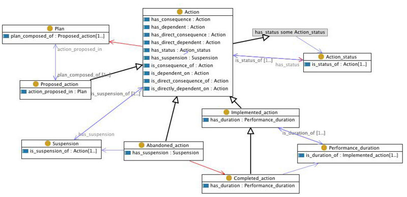

* [Image](../Image/Action.jpg#file)
* [File history](../Image/Action.jpg#filehistory)
* [Links](../Image/Action.jpg#filelinks)
* [Metadata](../Image/Action.jpg#metadata)

  
Size of this preview: 800 × 388 pixels  
[Full resolution](../images/9/97/Action.jpg)‎ (950 × 461 pixel, file size: 126 KB, MIME type: image/jpeg)The illustration of the Action Content ODP.

## File history

Click on a date/time to view the file as it appeared at that time.

  
* [Search for duplicate files](http://ontologydesignpatterns.org/wiki/Special:FileDuplicateSearch/Action.jpg "Special:FileDuplicateSearch/Action.jpg")
* [Edit this file using an external application](http://ontologydesignpatterns.org/wiki/index.php?title=Image:Action.jpg&action=edit&externaledit=true&mode=file "Image:Action.jpg")See the [setup instructions](http://www.mediawiki.org/wiki/Manual:External_editors "http://www.mediawiki.org/wiki/Manual:External_editors") for more information.

## Links

The following page links to this file:

* [Submissions:Action](../Submissions/Action "Submissions:Action")

## Metadata

This file contains additional information, probably added from the digital camera or scanner used to create or digitize it.
If the file has been modified from its original state, some details may not fully reflect the modified file.

Retrieved from "[http://ontologydesignpatterns.org/wiki/Image:Action.jpg](../Image/Action.jpg)"