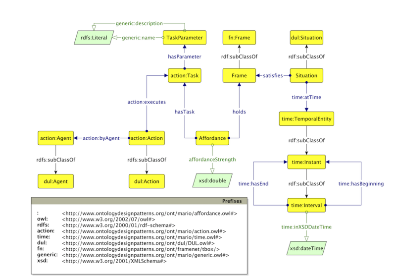

* [Image](../Image/Affordance.png.md#file)
* [File history](../Image/Affordance.png.md#filehistory)
* [Links](../Image/Affordance.png.md#filelinks)

  
Size of this preview: 800 × 565 pixels  
[Full resolution](../../images/b/b3/Affordance.png)‎ (1,210 × 855 pixel, file size: 271 KB, MIME type: image/png)The diagram of the Affordance ontology expressed with the Graffoo notation.

## File history

Click on a date/time to view the file as it appeared at that time.

  
* [Search for duplicate files](http://ontologydesignpatterns.org/wiki/Special:FileDuplicateSearch/Affordance.png "Special:FileDuplicateSearch/Affordance.png")
* [Edit this file using an external application](http://ontologydesignpatterns.org/wiki/index.php?title=Image:Affordance.png&action=edit&externaledit=true&mode=file "Image:Affordance.png")See the [setup instructions](http://www.mediawiki.org/wiki/Manual:External_editors "http://www.mediawiki.org/wiki/Manual:External_editors") for more information.

## Links

The following page links to this file:

* [Submissions:Affordance](../Submissions/Affordance.md "Submissions:Affordance")

Retrieved from "[http://ontologydesignpatterns.org/wiki/Image:Affordance.png](../Image/Affordance.png.md)"