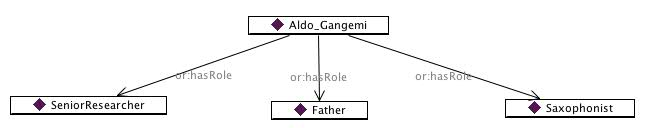

* [Image](../Image/Agentroleex.png.md#file)
* [File history](../Image/Agentroleex.png.md#filehistory)
* [Links](../Image/Agentroleex.png.md#filelinks)

  
No higher resolution available.  
[Agentroleex.png](../images/a/a0/Agentroleex.png)‎ (656 × 128 pixel, file size: 21 KB, MIME type: image/png)

## File history

Click on a date/time to view the file as it appeared at that time.

  
* [Search for duplicate files](http://ontologydesignpatterns.org/wiki/Special:FileDuplicateSearch/Agentroleex.png "Special:FileDuplicateSearch/Agentroleex.png")
* [Edit this file using an external application](http://ontologydesignpatterns.org/wiki/index.php?title=Image:Agentroleex.png&action=edit&externaledit=true&mode=file "Image:Agentroleex.png")See the [setup instructions](http://www.mediawiki.org/wiki/Manual:External_editors "http://www.mediawiki.org/wiki/Manual:External_editors") for more information.

## Links

The following 2 pages link to this file:

* [Community:Images](../Community/Images.md "Community:Images")
* [Submissions:AgentRole/Scenario 1](../Submissions/AgentRole/Scenario_1.md "Submissions:AgentRole/Scenario 1")

Retrieved from "[http://ontologydesignpatterns.org/wiki/Image:Agentroleex.png](../Image/Agentroleex.png.md)"