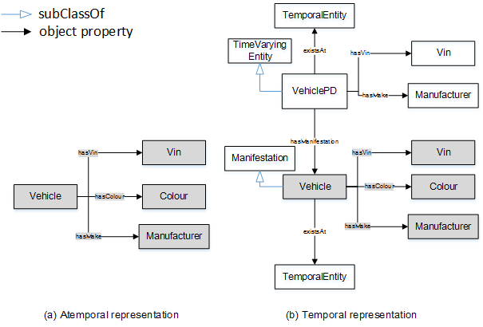

* [Image](../Image/Before-after.png.md#file)
* [File history](../Image/Before-after.png.md#filehistory)
* [Links](../Image/Before-after.png.md#filelinks)

  
No higher resolution available.  
[Before-after.png](../images/9/97/Before-after.png)‎ (605 × 410 pixel, file size: 26 KB, MIME type: image/png)Example definition of Vehicle before and after the application of the logical design patterns for capturing change.

## File history

Click on a date/time to view the file as it appeared at that time.

  
* [Search for duplicate files](http://ontologydesignpatterns.org/wiki/Special:FileDuplicateSearch/Before-after.png "Special:FileDuplicateSearch/Before-after.png")
* [Edit this file using an external application](http://ontologydesignpatterns.org/wiki/index.php?title=Image:Before-after.png&action=edit&externaledit=true&mode=file "Image:Before-after.png")See the [setup instructions](http://www.mediawiki.org/wiki/Manual:External_editors "http://www.mediawiki.org/wiki/Manual:External_editors") for more information.

## Links

The following page links to this file:

* [Submissions:Change of Time Varying Entities](../Submissions/Change_of_Time_Varying_Entities.md "Submissions:Change of Time Varying Entities")

Retrieved from "[http://ontologydesignpatterns.org/wiki/Image:Before-after.png](../Image/Before-after.png.md)"