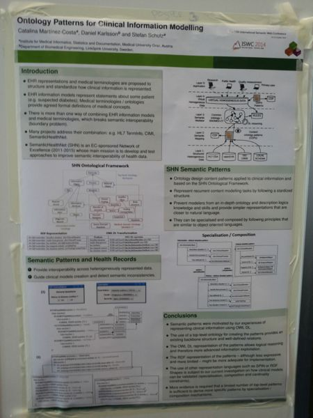

* [Image](../Image/Bestposter2014.jpg.md#file)
* [File history](../Image/Bestposter2014.jpg.md#filehistory)
* [Links](../Image/Bestposter2014.jpg.md#filelinks)
* [Metadata](../Image/Bestposter2014.jpg.md#metadata)

  
Size of this preview: 450 × 600 pixels  
[Full resolution](../../images/b/bb/Bestposter2014.jpg)‎ (1,500 × 2,000 pixel, file size: 386 KB, MIME type: image/jpeg)Best poster of WOP2014 as voted by the attendees

## File history

Click on a date/time to view the file as it appeared at that time.

  
* [Search for duplicate files](http://ontologydesignpatterns.org/wiki/Special:FileDuplicateSearch/Bestposter2014.jpg "Special:FileDuplicateSearch/Bestposter2014.jpg")
* [Edit this file using an external application](http://ontologydesignpatterns.org/wiki/index.php?title=Image:Bestposter2014.jpg&action=edit&externaledit=true&mode=file "Image:Bestposter2014.jpg")See the [setup instructions](http://www.mediawiki.org/wiki/Manual:External_editors "http://www.mediawiki.org/wiki/Manual:External_editors") for more information.

## Links

The following page links to this file:

* [WOP:2014](../WOP/2014.md "WOP:2014")

## Metadata

This file contains additional information, probably added from the digital camera or scanner used to create or digitize it.
If the file has been modified from its original state, some details may not fully reflect the modified file.

Retrieved from "[http://ontologydesignpatterns.org/wiki/Image:Bestposter2014.jpg](../Image/Bestposter2014.jpg.md)"