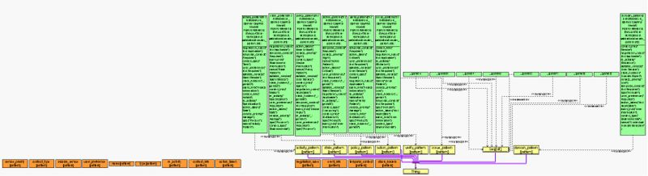

* [Image](../Image/CaRePa_Ontology_image2.jpg#file)
* [File history](../Image/CaRePa_Ontology_image2.jpg#filehistory)
* [Links](../Image/CaRePa_Ontology_image2.jpg#filelinks)

  
Size of this preview: 800 × 218 pixels  
[Full resolution](../images/a/a4/CaRePa_Ontology_image2.jpg)‎ (1,761 × 480 pixel, file size: 336 KB, MIME type: image/jpeg)This tree based image show the Context aware Requirement Pattern as ontology

## File history

Click on a date/time to view the file as it appeared at that time.

  
* [Search for duplicate files](http://ontologydesignpatterns.org/wiki/Special:FileDuplicateSearch/CaRePa_Ontology_image2.jpg "Special:FileDuplicateSearch/CaRePa Ontology image2.jpg")
* [Edit this file using an external application](http://ontologydesignpatterns.org/wiki/index.php?title=Image:CaRePa_Ontology_image2.jpg&action=edit&externaledit=true&mode=file "Image:CaRePa Ontology image2.jpg")See the [setup instructions](http://www.mediawiki.org/wiki/Manual:External_editors "http://www.mediawiki.org/wiki/Manual:External_editors") for more information.

## Links

There are no pages that link to this file.

Retrieved from "[http://ontologydesignpatterns.org/wiki/Image:CaRePa\_Ontology\_image2.jpg](../Image/CaRePa_Ontology_image2.jpg)"