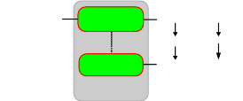

* [Image](../Image/Class-by-attribute-value.svg.md#file)
* [File history](../Image/Class-by-attribute-value.svg.md#filehistory)
* [Links](../Image/Class-by-attribute-value.svg.md#filelinks)

  

[Class-by-attribute-value.svg](../../images/d/d4/Class-by-attribute-value.svg "Class-by-attribute-value.svg")‎  (SVG file, nominally 274 × 114 pixels, file size: 14 KB)

## File history

Click on a date/time to view the file as it appeared at that time.

  
* [Search for duplicate files](http://ontologydesignpatterns.org/wiki/Special:FileDuplicateSearch/Class-by-attribute-value.svg "Special:FileDuplicateSearch/Class-by-attribute-value.svg")
* [Edit this file using an external application](http://ontologydesignpatterns.org/wiki/index.php?title=Image:Class-by-attribute-value.svg&action=edit&externaledit=true&mode=file "Image:Class-by-attribute-value.svg")See the [setup instructions](http://www.mediawiki.org/wiki/Manual:External_editors "http://www.mediawiki.org/wiki/Manual:External_editors") for more information.

## Links

The following page links to this file:

* [Community:Images](../Community/Images.md "Community:Images")

Retrieved from "[http://ontologydesignpatterns.org/wiki/Image:Class-by-attribute-value.svg](../Image/Class-by-attribute-value.svg.md)"