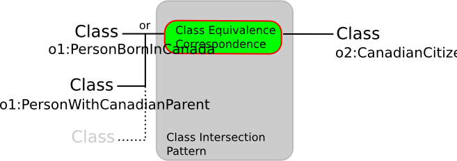

* [Image](../Image/Class-intersection.png#file)
* [File history](../Image/Class-intersection.png#filehistory)
* [Links](../Image/Class-intersection.png#filelinks)

  
No higher resolution available.  
[Class-intersection.png](../images/f/f2/Class-intersection.png)‎ (657 × 232 pixel, file size: 29 KB, MIME type: image/png)

## File history

Click on a date/time to view the file as it appeared at that time.

  
* [Search for duplicate files](http://ontologydesignpatterns.org/wiki/Special:FileDuplicateSearch/Class-intersection.png "Special:FileDuplicateSearch/Class-intersection.png")
* [Edit this file using an external application](http://ontologydesignpatterns.org/wiki/index.php?title=Image:Class-intersection.png&action=edit&externaledit=true&mode=file "Image:Class-intersection.png")See the [setup instructions](http://www.mediawiki.org/wiki/Manual:External_editors "http://www.mediawiki.org/wiki/Manual:External_editors") for more information.

## Links

The following page links to this file:

* [Submissions:Class intersection](../Submissions/Class_intersection "Submissions:Class intersection")

Retrieved from "[http://ontologydesignpatterns.org/wiki/Image:Class-intersection.png](../Image/Class-intersection.png)"