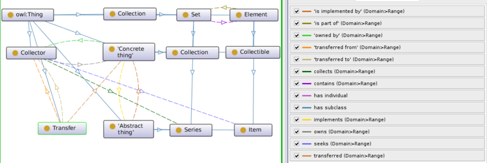

* [Image](../Image/Codp.png.md#file)
* [File history](../Image/Codp.png.md#filehistory)
* [Links](../Image/Codp.png.md#filelinks)

  
Size of this preview: 800 × 269 pixels  
[Full resolution](../images/2/2a/Codp.png)‎ (1,128 × 379 pixel, file size: 73 KB, MIME type: image/png)A visual summary of the Collections Ontology Design Pattern, extending a pre-existing design pattern.

## File history

Click on a date/time to view the file as it appeared at that time.

  
* [Search for duplicate files](http://ontologydesignpatterns.org/wiki/Special:FileDuplicateSearch/Codp.png "Special:FileDuplicateSearch/Codp.png")
* [Edit this file using an external application](http://ontologydesignpatterns.org/wiki/index.php?title=Image:Codp.png&action=edit&externaledit=true&mode=file "Image:Codp.png")See the [setup instructions](http://www.mediawiki.org/wiki/Manual:External_editors "http://www.mediawiki.org/wiki/Manual:External_editors") for more information.

## Links

There are no pages that link to this file.

Retrieved from "[http://ontologydesignpatterns.org/wiki/Image:Codp.png](../Image/Codp.png.md)"