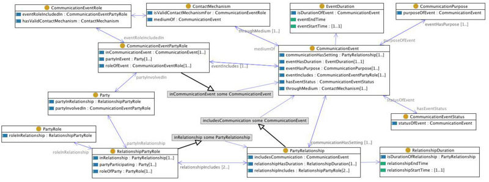

* [Image](../Image/CommunicationEvent.jpg.md#file)
* [File history](../Image/CommunicationEvent.jpg.md#filehistory)
* [Links](../Image/CommunicationEvent.jpg.md#filelinks)
* [Metadata](../Image/CommunicationEvent.jpg.md#metadata)

  
Size of this preview: 800 × 299 pixels  
[Full resolution](../images/a/aa/CommunicationEvent.jpg)‎ (1,307 × 488 pixel, file size: 197 KB, MIME type: image/jpeg)Illustration of the CommunicationEvent content pattern.

## File history

Click on a date/time to view the file as it appeared at that time.

  
* [Search for duplicate files](http://ontologydesignpatterns.org/wiki/Special:FileDuplicateSearch/CommunicationEvent.jpg "Special:FileDuplicateSearch/CommunicationEvent.jpg")
* [Edit this file using an external application](http://ontologydesignpatterns.org/wiki/index.php?title=Image:CommunicationEvent.jpg&action=edit&externaledit=true&mode=file "Image:CommunicationEvent.jpg")See the [setup instructions](http://www.mediawiki.org/wiki/Manual:External_editors "http://www.mediawiki.org/wiki/Manual:External_editors") for more information.

## Links

The following page links to this file:

* [Submissions:CommunicationEvent](../Submissions/CommunicationEvent.md "Submissions:CommunicationEvent")

## Metadata

This file contains additional information, probably added from the digital camera or scanner used to create or digitize it.
If the file has been modified from its original state, some details may not fully reflect the modified file.

Retrieved from "[http://ontologydesignpatterns.org/wiki/Image:CommunicationEvent.jpg](../Image/CommunicationEvent.jpg.md)"