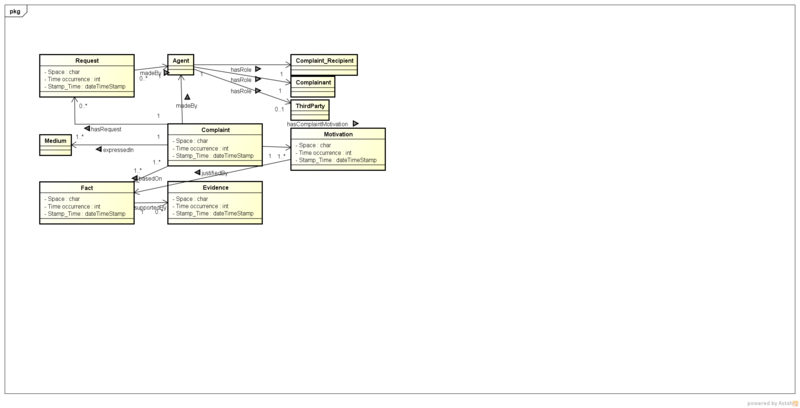

* [Image](../Image/Complaint.png.md#file)
* [File history](../Image/Complaint.png.md#filehistory)
* [Links](../Image/Complaint.png.md#filelinks)

  
Size of this preview: 800 × 408 pixels  
[Full resolution](../images/4/4e/Complaint.png)‎ (2,204 × 1,125 pixel, file size: 103 KB, MIME type: image/png)Constituents of COP: class labels are depicted using yellow nodes, and relationship between the classes are depicted by black arrows

## File history

Click on a date/time to view the file as it appeared at that time.

  
* [Search for duplicate files](http://ontologydesignpatterns.org/wiki/Special:FileDuplicateSearch/Complaint.png "Special:FileDuplicateSearch/Complaint.png")
* [Edit this file using an external application](http://ontologydesignpatterns.org/wiki/index.php?title=Image:Complaint.png&action=edit&externaledit=true&mode=file "Image:Complaint.png")See the [setup instructions](http://www.mediawiki.org/wiki/Manual:External_editors "http://www.mediawiki.org/wiki/Manual:External_editors") for more information.

## Links

There are no pages that link to this file.

Retrieved from "[http://ontologydesignpatterns.org/wiki/Image:Complaint.png](../Image/Complaint.png.md)"