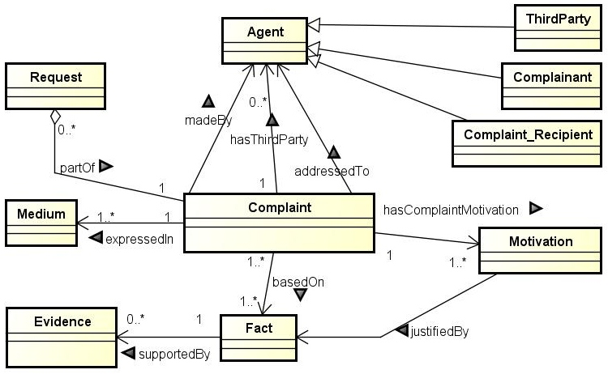

* [Image](../Image/Complaint_UML.jpg#file)
* [File history](../Image/Complaint_UML.jpg#filehistory)
* [Links](../Image/Complaint_UML.jpg#filelinks)
* [Metadata](../Image/Complaint_UML.jpg#metadata)

  
No higher resolution available.  
[Complaint\_UML.jpg](../images/1/1d/Complaint_UML.jpg)‎ (750 × 462 pixel, file size: 149 KB, MIME type: image/jpeg)

## File history

Click on a date/time to view the file as it appeared at that time.

  
* [Search for duplicate files](http://ontologydesignpatterns.org/wiki/Special:FileDuplicateSearch/Complaint_UML.jpg "Special:FileDuplicateSearch/Complaint UML.jpg")
* [Edit this file using an external application](http://ontologydesignpatterns.org/wiki/index.php?title=Image:Complaint_UML.jpg&action=edit&externaledit=true&mode=file "Image:Complaint UML.jpg")See the [setup instructions](http://www.mediawiki.org/wiki/Manual:External_editors "http://www.mediawiki.org/wiki/Manual:External_editors") for more information.

## Links

There are no pages that link to this file.

## Metadata

This file contains additional information, probably added from the digital camera or scanner used to create or digitize it.
If the file has been modified from its original state, some details may not fully reflect the modified file.

Retrieved from "[http://ontologydesignpatterns.org/wiki/Image:Complaint\_UML.jpg](../Image/Complaint_UML.jpg)"