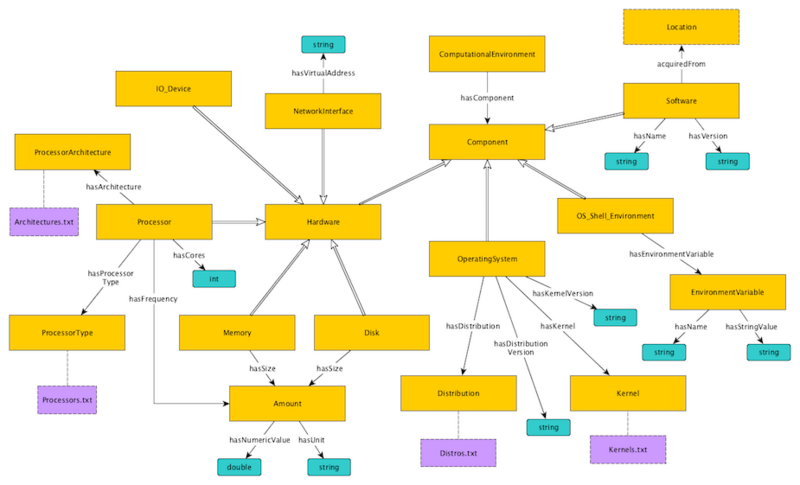

* [Image](../Image/ComputationalEnvironment.png#file)
* [File history](../Image/ComputationalEnvironment.png#filehistory)
* [Links](../Image/ComputationalEnvironment.png#filelinks)

  
Size of this preview: 800 × 485 pixels  
[Full resolution](../images/5/5b/ComputationalEnvironment.png)‎ (925 × 561 pixel, file size: 145 KB, MIME type: image/png)The Computational Environment ontology design pattern models the environment in which a computational analysis was conducted down to the hardware level. The pattern is intended to support comparison and reproducibility of computational analyses.

## File history

Click on a date/time to view the file as it appeared at that time.

  
* [Search for duplicate files](http://ontologydesignpatterns.org/wiki/Special:FileDuplicateSearch/ComputationalEnvironment.png "Special:FileDuplicateSearch/ComputationalEnvironment.png")
* [Edit this file using an external application](http://ontologydesignpatterns.org/wiki/index.php?title=Image:ComputationalEnvironment.png&action=edit&externaledit=true&mode=file "Image:ComputationalEnvironment.png")See the [setup instructions](http://www.mediawiki.org/wiki/Manual:External_editors "http://www.mediawiki.org/wiki/Manual:External_editors") for more information.

## Links

There are no pages that link to this file.

Retrieved from "[http://ontologydesignpatterns.org/wiki/Image:ComputationalEnvironment.png](../Image/ComputationalEnvironment.png)"