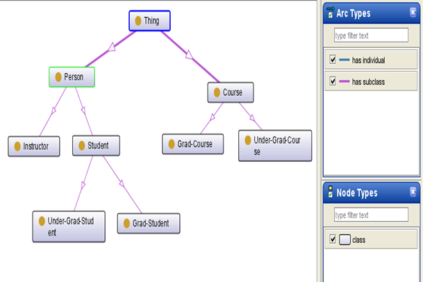

* [Image](../Image/Course_diagram.png#file)
* [File history](../Image/Course_diagram.png#filehistory)
* [Links](../Image/Course_diagram.png#filelinks)

  
No higher resolution available.  
[Course\_diagram.png](../images/c/c8/Course_diagram.png)‎ (609 × 406 pixel, file size: 55 KB, MIME type: image/png)

## File history

Click on a date/time to view the file as it appeared at that time.

  
* [Search for duplicate files](http://ontologydesignpatterns.org/wiki/Special:FileDuplicateSearch/Course_diagram.png "Special:FileDuplicateSearch/Course diagram.png")
* [Edit this file using an external application](http://ontologydesignpatterns.org/wiki/index.php?title=Image:Course_diagram.png&action=edit&externaledit=true&mode=file "Image:Course diagram.png")See the [setup instructions](http://www.mediawiki.org/wiki/Manual:External_editors "http://www.mediawiki.org/wiki/Manual:External_editors") for more information.

## Links

The following page links to this file:

* [Submissions:Course](../Submissions/Course "Submissions:Course")

Retrieved from "[http://ontologydesignpatterns.org/wiki/Image:Course\_diagram.png](../Image/Course_diagram.png)"