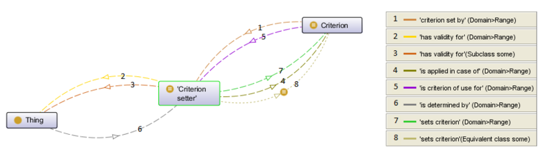

* [Image](../Image/Criterion_setter.png#file)
* [File history](../Image/Criterion_setter.png#filehistory)
* [Links](../Image/Criterion_setter.png#filelinks)

  
Size of this preview: 800 × 240 pixels  
[Full resolution](../images/c/cf/Criterion_setter.png)‎ (908 × 272 pixel, file size: 43 KB, MIME type: image/png)

## File history

Click on a date/time to view the file as it appeared at that time.

  
* [Search for duplicate files](http://ontologydesignpatterns.org/wiki/Special:FileDuplicateSearch/Criterion_setter.png "Special:FileDuplicateSearch/Criterion setter.png")
* [Edit this file using an external application](http://ontologydesignpatterns.org/wiki/index.php?title=Image:Criterion_setter.png&action=edit&externaledit=true&mode=file "Image:Criterion setter.png")See the [setup instructions](http://www.mediawiki.org/wiki/Manual:External_editors "http://www.mediawiki.org/wiki/Manual:External_editors") for more information.

## Links

The following page links to this file:

* [Submissions:CriterionSetter](../Submissions/CriterionSetter "Submissions:CriterionSetter")

Retrieved from "[http://ontologydesignpatterns.org/wiki/Image:Criterion\_setter.png](../Image/Criterion_setter.png)"