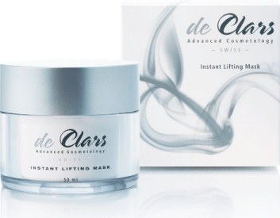

* [Image](../Image/De_Clars_Instant_Lifting_Mask.jpg.md#file)
* [File history](../Image/De_Clars_Instant_Lifting_Mask.jpg.md#filehistory)
* [Links](../Image/De_Clars_Instant_Lifting_Mask.jpg.md#filelinks)
* [Metadata](../Image/De_Clars_Instant_Lifting_Mask.jpg.md#metadata)

  
No higher resolution available.  
[De\_Clars\_Instant\_Lifting\_Mask.jpg](../images/a/aa/De_Clars_Instant_Lifting_Mask.jpg)‎ (353 × 275 pixel, file size: 23 KB, MIME type: image/jpeg)de Clars Intensive Lifting Mask

This mask gives you supple and youthful looking skin. It supplies the skin with deep penetrating moisture. Smoothes lines and wrinkles visibly and immediate. Strengthens skin structure and improves elasticity Natural extracts reduce the signs of an aging skin. Skin instantly appears fresh, smooth, radiant and revitalized. 
Instant Lifting Mask uses a revolutionary combination of active ingredients which supports the skin’s natural ability to repair DNA and maintains cell function on an optimal level as long as possible.

## File history

Click on a date/time to view the file as it appeared at that time.

  
* [Search for duplicate files](http://ontologydesignpatterns.org/wiki/Special:FileDuplicateSearch/De_Clars_Instant_Lifting_Mask.jpg "Special:FileDuplicateSearch/De Clars Instant Lifting Mask.jpg")
* [Edit this file using an external application](http://ontologydesignpatterns.org/wiki/index.php?title=Image:De_Clars_Instant_Lifting_Mask.jpg&action=edit&externaledit=true&mode=file "Image:De Clars Instant Lifting Mask.jpg")See the [setup instructions](http://www.mediawiki.org/wiki/Manual:External_editors "http://www.mediawiki.org/wiki/Manual:External_editors") for more information.

## Links

There are no pages that link to this file.

## Metadata

This file contains additional information, probably added from the digital camera or scanner used to create or digitize it.
If the file has been modified from its original state, some details may not fully reflect the modified file.

Retrieved from "[http://ontologydesignpatterns.org/wiki/Image:De\_Clars\_Instant\_Lifting\_Mask.jpg](../Image/De_Clars_Instant_Lifting_Mask.jpg.md)"