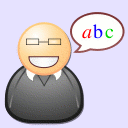

* [Image](../Image/Definition.gif#file)
* [File history](../Image/Definition.gif#filehistory)
* [Links](../Image/Definition.gif#filelinks)

  
No higher resolution available.  
[Definition.gif](../images/6/6f/Definition.gif)‎ (128 × 128 pixel, file size: 7 KB, MIME type: image/gif)

## File history

Click on a date/time to view the file as it appeared at that time.

  
* [Search for duplicate files](http://ontologydesignpatterns.org/wiki/Special:FileDuplicateSearch/Definition.gif "Special:FileDuplicateSearch/Definition.gif")
* [Edit this file using an external application](http://ontologydesignpatterns.org/wiki/index.php?title=Image:Definition.gif&action=edit&externaledit=true&mode=file "Image:Definition.gif")See the [setup instructions](http://www.mediawiki.org/wiki/Manual:External_editors "http://www.mediawiki.org/wiki/Manual:External_editors") for more information.

## Links

The following 18 pages link to this file:

* [Community:Images](../Community/Images "Community:Images")
* [Category:ContentOP](../Category/ContentOP "Category:ContentOP")
* [OPTypes](../OPTypes "OPTypes")
* [Template:Definition](../Template/Definition "Template:Definition")
* [Odp:Development/Tests](../Odp/Development/Tests "Odp:Development/Tests")
* [Category:LogicalOP](../Category/LogicalOP "Category:LogicalOP")
* [Category:ArchitecturalOP](../Category/ArchitecturalOP "Category:ArchitecturalOP")
* [Category:PresentationOP](../Category/PresentationOP "Category:PresentationOP")
* [Category:NamingOP](../Category/NamingOP "Category:NamingOP")
* [Category:AnnotationOP](../Category/AnnotationOP "Category:AnnotationOP")
* [Category:AlignmentOP](../Category/AlignmentOP "Category:AlignmentOP")
* [Category:StructuralOP](../Category/StructuralOP "Category:StructuralOP")
* [Category:CorrespondenceOP](../Category/CorrespondenceOP "Category:CorrespondenceOP")
* [Category:ReengineeringOP](../Category/ReengineeringOP "Category:ReengineeringOP")
* [Category:SchemaReengineeringOP](../Category/SchemaReengineeringOP "Category:SchemaReengineeringOP")
* [Category:ReasoningOP](../Category/ReasoningOP "Category:ReasoningOP")
* [Category:LexicoSyntacticOP](../Category/LexicoSyntacticOP "Category:LexicoSyntacticOP")
* [Category:OntologyDesignPattern](../Category/OntologyDesignPattern "Category:OntologyDesignPattern")

Retrieved from "[http://ontologydesignpatterns.org/wiki/Image:Definition.gif](../Image/Definition.gif)"