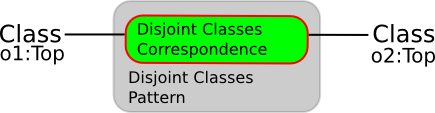

* [Image](../Image/Disjoint-classes-correspondence.png#file)
* [File history](../Image/Disjoint-classes-correspondence.png#filehistory)
* [Links](../Image/Disjoint-classes-correspondence.png#filelinks)

  
No higher resolution available.  
[Disjoint-classes-correspondence.png](../images/0/06/Disjoint-classes-correspondence.png)‎ (435 × 113 pixel, file size: 15 KB, MIME type: image/png)

## File history

Click on a date/time to view the file as it appeared at that time.

  
* [Search for duplicate files](http://ontologydesignpatterns.org/wiki/Special:FileDuplicateSearch/Disjoint-classes-correspondence.png "Special:FileDuplicateSearch/Disjoint-classes-correspondence.png")
* [Edit this file using an external application](http://ontologydesignpatterns.org/wiki/index.php?title=Image:Disjoint-classes-correspondence.png&action=edit&externaledit=true&mode=file "Image:Disjoint-classes-correspondence.png")See the [setup instructions](http://www.mediawiki.org/wiki/Manual:External_editors "http://www.mediawiki.org/wiki/Manual:External_editors") for more information.

## Links

There are no pages that link to this file.

Retrieved from "[http://ontologydesignpatterns.org/wiki/Image:Disjoint-classes-correspondence.png](../Image/Disjoint-classes-correspondence.png)"