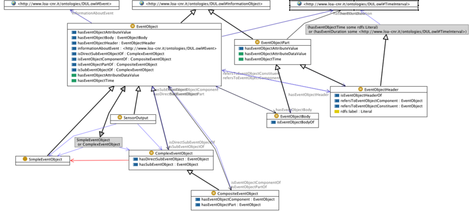

* [Image](../Image/EP_ODP.png.md#file)
* [File history](../Image/EP_ODP.png.md#filehistory)
* [Links](../Image/EP_ODP.png.md#filelinks)

  
Size of this preview: 800 × 362 pixels  
[Full resolution](../images/9/93/EP_ODP.png)‎ (1,398 × 632 pixel, file size: 171 KB, MIME type: image/png)Figure illustrating the main classes of the (revised version of the) Event Processing ODP

## File history

Click on a date/time to view the file as it appeared at that time.

  
* [Search for duplicate files](http://ontologydesignpatterns.org/wiki/Special:FileDuplicateSearch/EP_ODP.png "Special:FileDuplicateSearch/EP ODP.png")
* [Edit this file using an external application](http://ontologydesignpatterns.org/wiki/index.php?title=Image:EP_ODP.png&action=edit&externaledit=true&mode=file "Image:EP ODP.png")See the [setup instructions](http://www.mediawiki.org/wiki/Manual:External_editors "http://www.mediawiki.org/wiki/Manual:External_editors") for more information.

## Links

The following page links to this file:

* [Submissions:EventProcessing](../Submissions/EventProcessing.md "Submissions:EventProcessing")

Retrieved from "[http://ontologydesignpatterns.org/wiki/Image:EP\_ODP.png](../Image/EP_ODP.png.md)"