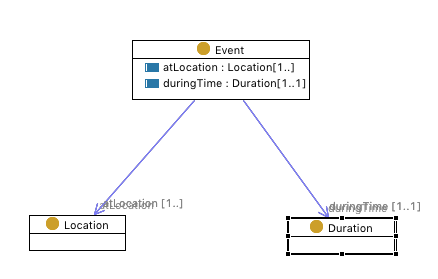

* [Image](../Image/Eswc2017-tutorial-event.png.md#file)
* [File history](../Image/Eswc2017-tutorial-event.png.md#filehistory)
* [Links](../Image/Eswc2017-tutorial-event.png.md#filelinks)

  
No higher resolution available.  
[Eswc2017-tutorial-event.png](../images/6/64/Eswc2017-tutorial-event.png)‎ (438 × 279 pixel, file size: 16 KB, MIME type: image/png)Illustration for an ODP used in Training:Tutorial:\_Modular\_Ontology\_Modeling\_with\_Ontology\_Design\_Patterns\_at\_ESWC2017

## File history

Click on a date/time to view the file as it appeared at that time.

  
* [Search for duplicate files](http://ontologydesignpatterns.org/wiki/Special:FileDuplicateSearch/Eswc2017-tutorial-event.png "Special:FileDuplicateSearch/Eswc2017-tutorial-event.png")
* [Edit this file using an external application](http://ontologydesignpatterns.org/wiki/index.php?title=Image:Eswc2017-tutorial-event.png&action=edit&externaledit=true&mode=file "Image:Eswc2017-tutorial-event.png")See the [setup instructions](http://www.mediawiki.org/wiki/Manual:External_editors "http://www.mediawiki.org/wiki/Manual:External_editors") for more information.

## Links

There are no pages that link to this file.

Retrieved from "[http://ontologydesignpatterns.org/wiki/Image:Eswc2017-tutorial-event.png](../Image/Eswc2017-tutorial-event.png.md)"