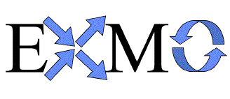

* [Image](../Image/Exmo-medium.gif.md#file)
* [File history](../Image/Exmo-medium.gif.md#filehistory)
* [Links](../Image/Exmo-medium.gif.md#filelinks)

  
No higher resolution available.  
[Exmo-medium.gif](../images/0/09/Exmo-medium.gif)‎ (328 × 142 pixel, file size: 5 KB, MIME type: image/gif)

## File history

Click on a date/time to view the file as it appeared at that time.

  
* [Search for duplicate files](http://ontologydesignpatterns.org/wiki/Special:FileDuplicateSearch/Exmo-medium.gif "Special:FileDuplicateSearch/Exmo-medium.gif")
* [Edit this file using an external application](http://ontologydesignpatterns.org/wiki/index.php?title=Image:Exmo-medium.gif&action=edit&externaledit=true&mode=file "Image:Exmo-medium.gif")See the [setup instructions](http://www.mediawiki.org/wiki/Manual:External_editors "http://www.mediawiki.org/wiki/Manual:External_editors") for more information.

## Links

The following page links to this file:

* [Odp:Partners](../Odp/Partners.md "Odp:Partners")

Retrieved from "[http://ontologydesignpatterns.org/wiki/Image:Exmo-medium.gif](../Image/Exmo-medium.gif.md)"