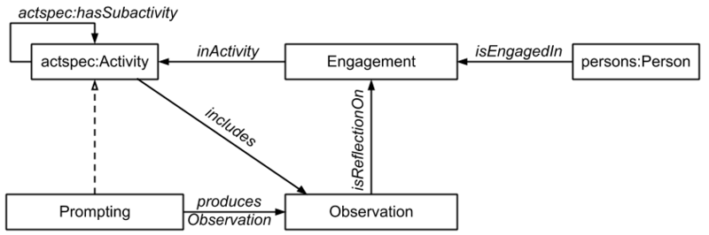

* [Image](../Image/Experience_and_observation.png#file)
* [File history](../Image/Experience_and_observation.png#filehistory)
* [Links](../Image/Experience_and_observation.png#filelinks)

  
Size of this preview: 800 × 266 pixels  
[Full resolution](../images/a/a0/Experience_and_observation.png)‎ (841 × 280 pixel, file size: 20 KB, MIME type: image/png)Diagram (as PNG) showing the core relations of the Experience & Observation content pattern.

## File history

Click on a date/time to view the file as it appeared at that time.

  
* [Search for duplicate files](http://ontologydesignpatterns.org/wiki/Special:FileDuplicateSearch/Experience_and_observation.png "Special:FileDuplicateSearch/Experience and observation.png")
* [Edit this file using an external application](http://ontologydesignpatterns.org/wiki/index.php?title=Image:Experience_and_observation.png&action=edit&externaledit=true&mode=file "Image:Experience and observation.png")See the [setup instructions](http://www.mediawiki.org/wiki/Manual:External_editors "http://www.mediawiki.org/wiki/Manual:External_editors") for more information.

## Links

The following page links to this file:

* [Submissions:Experience & Observation](../Submissions/Experience_&_Observation "Submissions:Experience & Observation")

Retrieved from "[http://ontologydesignpatterns.org/wiki/Image:Experience\_and\_observation.png](../Image/Experience_and_observation.png)"