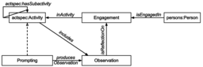

* [Image](../Image/Experience_and_observation.svg.md#file)
* [File history](../Image/Experience_and_observation.svg.md#filehistory)
* [Links](../Image/Experience_and_observation.svg.md#filelinks)

  

[Experience\_and\_observation.svg](../images/7/7e/Experience_and_observation.svg "Experience and observation.svg")‎  (SVG file, nominally 256 × 256 pixels, file size: 91 KB)

Diagram representing the key relations of the Experience & Observation content pattern.

## File history

Click on a date/time to view the file as it appeared at that time.

  
* [Search for duplicate files](http://ontologydesignpatterns.org/wiki/Special:FileDuplicateSearch/Experience_and_observation.svg "Special:FileDuplicateSearch/Experience and observation.svg")
* [Edit this file using an external application](http://ontologydesignpatterns.org/wiki/index.php?title=Image:Experience_and_observation.svg&action=edit&externaledit=true&mode=file "Image:Experience and observation.svg")See the [setup instructions](http://www.mediawiki.org/wiki/Manual:External_editors "http://www.mediawiki.org/wiki/Manual:External_editors") for more information.

## Links

There are no pages that link to this file.

Retrieved from "[http://ontologydesignpatterns.org/wiki/Image:Experience\_and\_observation.svg](../Image/Experience_and_observation.svg.md)"