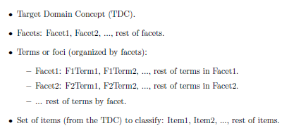

* [Image](../Image/FacetedClassificationScheme_GenericStructure.png.md#file)
* [File history](../Image/FacetedClassificationScheme_GenericStructure.png.md#filehistory)
* [Links](../Image/FacetedClassificationScheme_GenericStructure.png.md#filelinks)

  
No higher resolution available.  
[FacetedClassificationScheme\_GenericStructure.png](../images/9/99/FacetedClassificationScheme_GenericStructure.png)‎ (410 × 189 pixel, file size: 20 KB, MIME type: image/png)Elements of the generic structure of a Faceted Classification Scheme from the field of Information and Library Science.

## File history

Click on a date/time to view the file as it appeared at that time.

  
* [Search for duplicate files](http://ontologydesignpatterns.org/wiki/Special:FileDuplicateSearch/FacetedClassificationScheme_GenericStructure.png "Special:FileDuplicateSearch/FacetedClassificationScheme GenericStructure.png")
* [Edit this file using an external application](http://ontologydesignpatterns.org/wiki/index.php?title=Image:FacetedClassificationScheme_GenericStructure.png&action=edit&externaledit=true&mode=file "Image:FacetedClassificationScheme GenericStructure.png")See the [setup instructions](http://www.mediawiki.org/wiki/Manual:External_editors "http://www.mediawiki.org/wiki/Manual:External_editors") for more information.

## Links

The following page links to this file:

* [Submissions:Faceted Classification Scheme](../Submissions/Faceted_Classification_Scheme.md "Submissions:Faceted Classification Scheme")

Retrieved from "[http://ontologydesignpatterns.org/wiki/Image:FacetedClassificationScheme\_GenericStructure.png](../Image/FacetedClassificationScheme_GenericStructure.png.md)"