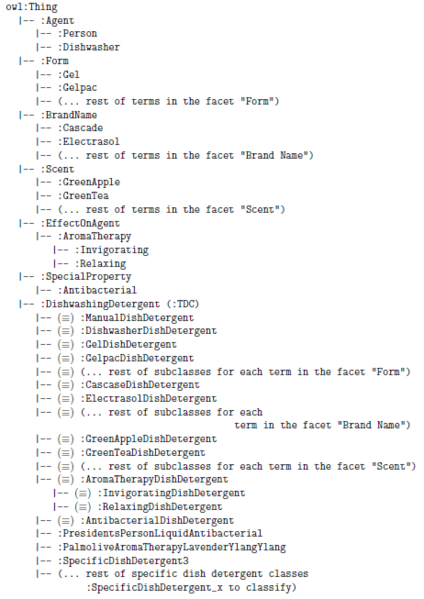

* [Image](../Image/FacetedClassificationStructureOntologyExample.png.md#file)
* [File history](../Image/FacetedClassificationStructureOntologyExample.png.md#filehistory)
* [Links](../Image/FacetedClassificationStructureOntologyExample.png.md#filelinks)

  
Size of this preview: 424 × 599 pixels  
[Full resolution](../../images/0/03/FacetedClassificationStructureOntologyExample.png)‎ (462 × 653 pixel, file size: 62 KB, MIME type: image/png)Example ontology model of a Faceted Classification Scheme using the Normalization ODP.

## File history

Click on a date/time to view the file as it appeared at that time.

  
* [Search for duplicate files](http://ontologydesignpatterns.org/wiki/Special:FileDuplicateSearch/FacetedClassificationStructureOntologyExample.png "Special:FileDuplicateSearch/FacetedClassificationStructureOntologyExample.png")
* [Edit this file using an external application](http://ontologydesignpatterns.org/wiki/index.php?title=Image:FacetedClassificationStructureOntologyExample.png&action=edit&externaledit=true&mode=file "Image:FacetedClassificationStructureOntologyExample.png")See the [setup instructions](http://www.mediawiki.org/wiki/Manual:External_editors "http://www.mediawiki.org/wiki/Manual:External_editors") for more information.

## Links

The following file is a duplicate of this file:

* [Image:FacetedClassificationStructureOntologyExample2.png](../Image/FacetedClassificationStructureOntologyExample2.png.md "Image:FacetedClassificationStructureOntologyExample2.png")

The following page links to this file:

* [Submissions:Faceted Classification Scheme](../Submissions/Faceted_Classification_Scheme.md "Submissions:Faceted Classification Scheme")

Retrieved from "[http://ontologydesignpatterns.org/wiki/Image:FacetedClassificationStructureOntologyExample.png](../Image/FacetedClassificationStructureOntologyExample.png.md)"