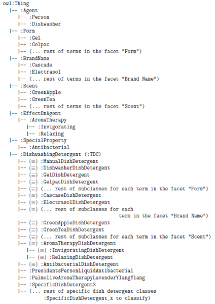

* [Image](../Image/FacetedClassificationStructureOntologyExample2.png#file)
* [File history](../Image/FacetedClassificationStructureOntologyExample2.png#filehistory)
* [Links](../Image/FacetedClassificationStructureOntologyExample2.png#filelinks)

  
Size of this preview: 424 × 599 pixels  
[Full resolution](../images/1/11/FacetedClassificationStructureOntologyExample2.png)‎ (462 × 653 pixel, file size: 62 KB, MIME type: image/png)Example ontology model of a Faceted Classification Scheme using the Normalization ODP.

## File history

Click on a date/time to view the file as it appeared at that time.

  
* [Search for duplicate files](http://ontologydesignpatterns.org/wiki/Special:FileDuplicateSearch/FacetedClassificationStructureOntologyExample2.png "Special:FileDuplicateSearch/FacetedClassificationStructureOntologyExample2.png")
* [Edit this file using an external application](http://ontologydesignpatterns.org/wiki/index.php?title=Image:FacetedClassificationStructureOntologyExample2.png&action=edit&externaledit=true&mode=file "Image:FacetedClassificationStructureOntologyExample2.png")See the [setup instructions](http://www.mediawiki.org/wiki/Manual:External_editors "http://www.mediawiki.org/wiki/Manual:External_editors") for more information.

## Links

The following file is a duplicate of this file:

* [Image:FacetedClassificationStructureOntologyExample.png](../Image/FacetedClassificationStructureOntologyExample.png "Image:FacetedClassificationStructureOntologyExample.png")

There are no pages that link to this file.

Retrieved from "[http://ontologydesignpatterns.org/wiki/Image:FacetedClassificationStructureOntologyExample2.png](../Image/FacetedClassificationStructureOntologyExample2.png)"