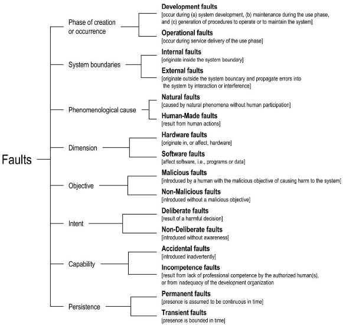

* [Image](../Image/Fig_avizienis_fault_4.jpg.md#file)
* [File history](../Image/Fig_avizienis_fault_4.jpg.md#filehistory)
* [Links](../Image/Fig_avizienis_fault_4.jpg.md#filelinks)

  
No higher resolution available.  
[Fig\_avizienis\_fault\_4.jpg](../images/5/5b/Fig_avizienis_fault_4.jpg)‎ (581 × 550 pixel, file size: 51 KB, MIME type: image/jpeg)

## File history

Click on a date/time to view the file as it appeared at that time.

  
* [Search for duplicate files](http://ontologydesignpatterns.org/wiki/Special:FileDuplicateSearch/Fig_avizienis_fault_4.jpg "Special:FileDuplicateSearch/Fig avizienis fault 4.jpg")
* [Edit this file using an external application](http://ontologydesignpatterns.org/wiki/index.php?title=Image:Fig_avizienis_fault_4.jpg&action=edit&externaledit=true&mode=file "Image:Fig avizienis fault 4.jpg")See the [setup instructions](http://www.mediawiki.org/wiki/Manual:External_editors "http://www.mediawiki.org/wiki/Manual:External_editors") for more information.

## Links

The following page links to this file:

* [Submissions:View Inheritance](../Submissions/View_Inheritance.md "Submissions:View Inheritance")

Retrieved from "[http://ontologydesignpatterns.org/wiki/Image:Fig\_avizienis\_fault\_4.jpg](../Image/Fig_avizienis_fault_4.jpg.md)"