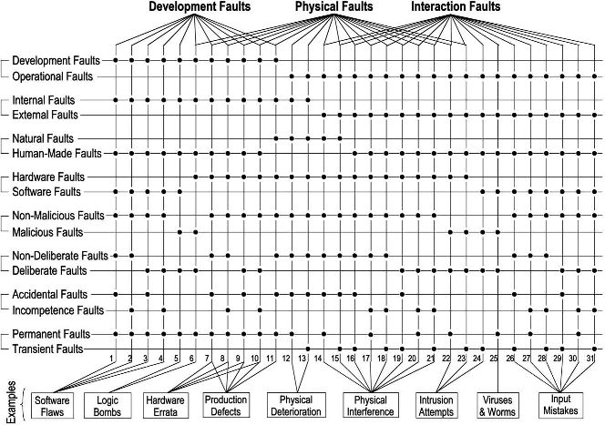

* [Image](../Image/Fig_avizienis_fault_5a.jpg#file)
* [File history](../Image/Fig_avizienis_fault_5a.jpg#filehistory)
* [Links](../Image/Fig_avizienis_fault_5a.jpg#filelinks)

  
No higher resolution available.  
[Fig\_avizienis\_fault\_5a.jpg](../images/4/45/Fig_avizienis_fault_5a.jpg)‎ (664 × 467 pixel, file size: 93 KB, MIME type: image/jpeg)Matrix representation of _Fault_ in Avizienis et al. [1] used in the ReSIST KB
ontology

[1] Avizienis, A., Laprie, J.C., Randell, B., Landwehr, C.: Basic concepts and taxonomy of dependable and secure computing. IEEE Transactions on Dependable and Secure Computing 01(1) (2004) 11--33

## File history

Click on a date/time to view the file as it appeared at that time.

  
* [Search for duplicate files](http://ontologydesignpatterns.org/wiki/Special:FileDuplicateSearch/Fig_avizienis_fault_5a.jpg "Special:FileDuplicateSearch/Fig avizienis fault 5a.jpg")
* [Edit this file using an external application](http://ontologydesignpatterns.org/wiki/index.php?title=Image:Fig_avizienis_fault_5a.jpg&action=edit&externaledit=true&mode=file "Image:Fig avizienis fault 5a.jpg")See the [setup instructions](http://www.mediawiki.org/wiki/Manual:External_editors "http://www.mediawiki.org/wiki/Manual:External_editors") for more information.

## Links

The following page links to this file:

* [Submissions:View Inheritance](../Submissions/View_Inheritance "Submissions:View Inheritance")

Retrieved from "[http://ontologydesignpatterns.org/wiki/Image:Fig\_avizienis\_fault\_5a.jpg](../Image/Fig_avizienis_fault_5a.jpg)"