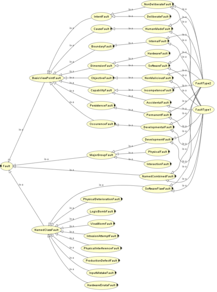

* [Image](../Image/Fig_fault_f1_f2_asserted_prot4x.png.md#file)
* [File history](../Image/Fig_fault_f1_f2_asserted_prot4x.png.md#filehistory)
* [Links](../Image/Fig_fault_f1_f2_asserted_prot4x.png.md#filelinks)

  
Size of this preview: 447 × 600 pixels  
[Full resolution](../../images/a/ac/Fig_fault_f1_f2_asserted_prot4x.png)‎ (744 × 998 pixel, file size: 119 KB, MIME type: image/png)

## File history

Click on a date/time to view the file as it appeared at that time.

  
* [Search for duplicate files](http://ontologydesignpatterns.org/wiki/Special:FileDuplicateSearch/Fig_fault_f1_f2_asserted_prot4x.png "Special:FileDuplicateSearch/Fig fault f1 f2 asserted prot4x.png")
* [Edit this file using an external application](http://ontologydesignpatterns.org/wiki/index.php?title=Image:Fig_fault_f1_f2_asserted_prot4x.png&action=edit&externaledit=true&mode=file "Image:Fig fault f1 f2 asserted prot4x.png")See the [setup instructions](http://www.mediawiki.org/wiki/Manual:External_editors "http://www.mediawiki.org/wiki/Manual:External_editors") for more information.

## Links

The following page links to this file:

* [Submissions:View Inheritance](../Submissions/View_Inheritance.md "Submissions:View Inheritance")

Retrieved from "[http://ontologydesignpatterns.org/wiki/Image:Fig\_fault\_f1\_f2\_asserted\_prot4x.png](../Image/Fig_fault_f1_f2_asserted_prot4x.png.md)"