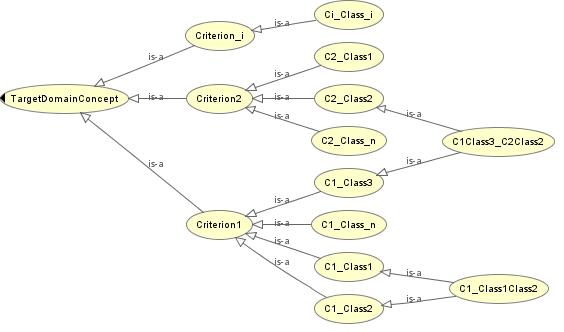

* [Image](../Image/Fig_view_inheritance_structure.png.md#file)
* [File history](../Image/Fig_view_inheritance_structure.png.md#filehistory)
* [Links](../Image/Fig_view_inheritance_structure.png.md#filelinks)

  
No higher resolution available.  
[Fig\_view\_inheritance\_structure.png](../images/0/0a/Fig_view_inheritance_structure.png)‎ (564 × 332 pixel, file size: 27 KB, MIME type: image/png)The figure shows a graphical generic structure of the View Inheritance OP

## File history

Click on a date/time to view the file as it appeared at that time.

  
* [Search for duplicate files](http://ontologydesignpatterns.org/wiki/Special:FileDuplicateSearch/Fig_view_inheritance_structure.png "Special:FileDuplicateSearch/Fig view inheritance structure.png")
* [Edit this file using an external application](http://ontologydesignpatterns.org/wiki/index.php?title=Image:Fig_view_inheritance_structure.png&action=edit&externaledit=true&mode=file "Image:Fig view inheritance structure.png")See the [setup instructions](http://www.mediawiki.org/wiki/Manual:External_editors "http://www.mediawiki.org/wiki/Manual:External_editors") for more information.

## Links

The following page links to this file:

* [Submissions:View Inheritance](../Submissions/View_Inheritance.md "Submissions:View Inheritance")

Retrieved from "[http://ontologydesignpatterns.org/wiki/Image:Fig\_view\_inheritance\_structure.png](../Image/Fig_view_inheritance_structure.png.md)"