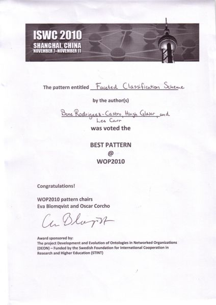

* [Image](../Image/Fig_wop2010_award.jpg.md#file)
* [File history](../Image/Fig_wop2010_award.jpg.md#filehistory)
* [Links](../Image/Fig_wop2010_award.jpg.md#filelinks)

  
Size of this preview: 424 × 599 pixels  
[Full resolution](../images/5/5a/Fig_wop2010_award.jpg)‎ (1,240 × 1,753 pixel, file size: 206 KB, MIME type: image/jpeg)Best Pattern Award at WOP2010

## File history

Click on a date/time to view the file as it appeared at that time.

  
* [Search for duplicate files](http://ontologydesignpatterns.org/wiki/Special:FileDuplicateSearch/Fig_wop2010_award.jpg "Special:FileDuplicateSearch/Fig wop2010 award.jpg")
* [Edit this file using an external application](http://ontologydesignpatterns.org/wiki/index.php?title=Image:Fig_wop2010_award.jpg&action=edit&externaledit=true&mode=file "Image:Fig wop2010 award.jpg")See the [setup instructions](http://www.mediawiki.org/wiki/Manual:External_editors "http://www.mediawiki.org/wiki/Manual:External_editors") for more information.

## Links

The following page links to this file:

* [WOP:2010](../WOP/2010.md "WOP:2010")

Retrieved from "[http://ontologydesignpatterns.org/wiki/Image:Fig\_wop2010\_award.jpg](../Image/Fig_wop2010_award.jpg.md)"