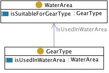

* [Image](../Image/Gearwaterarea.jpg.md#file)
* [File history](../Image/Gearwaterarea.jpg.md#filehistory)
* [Links](../Image/Gearwaterarea.jpg.md#filelinks)

  
No higher resolution available.  
[Gearwaterarea.jpg](../images/6/6e/Gearwaterarea.jpg)‎ (217 × 145 pixel, file size: 25 KB, MIME type: image/jpeg)

## File history

Click on a date/time to view the file as it appeared at that time.

  
* [Search for duplicate files](http://ontologydesignpatterns.org/wiki/Special:FileDuplicateSearch/Gearwaterarea.jpg "Special:FileDuplicateSearch/Gearwaterarea.jpg")
* [Edit this file using an external application](http://ontologydesignpatterns.org/wiki/index.php?title=Image:Gearwaterarea.jpg&action=edit&externaledit=true&mode=file "Image:Gearwaterarea.jpg")See the [setup instructions](http://www.mediawiki.org/wiki/Manual:External_editors "http://www.mediawiki.org/wiki/Manual:External_editors") for more information.

## Links

The following 2 pages link to this file:

* [Community:Images](../Community/Images.md "Community:Images")
* [Submissions:GearWaterArea](../Submissions/GearWaterArea.md "Submissions:GearWaterArea")

Retrieved from "[http://ontologydesignpatterns.org/wiki/Image:Gearwaterarea.jpg](../Image/Gearwaterarea.jpg.md)"