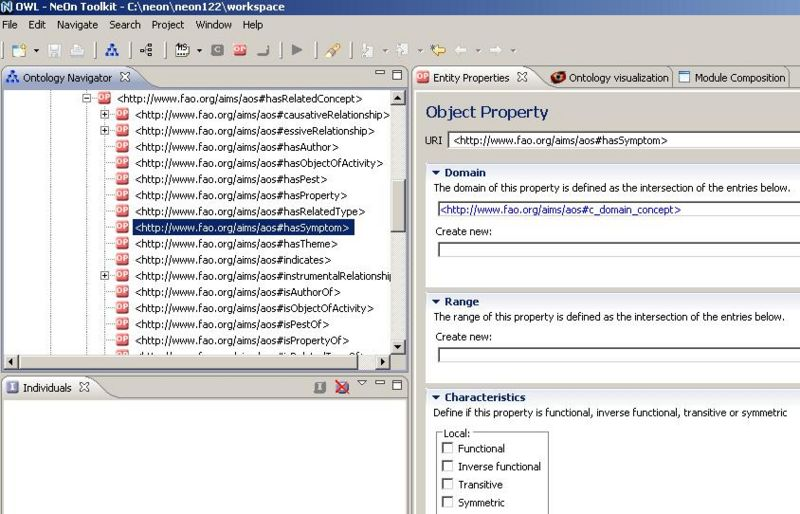

* [Image](../Image/HasSymptoms.JPG.md#file)
* [File history](../Image/HasSymptoms.JPG.md#filehistory)
* [Links](../Image/HasSymptoms.JPG.md#filelinks)

  
Size of this preview: 800 × 514 pixels  
[Full resolution](../../images/7/75/HasSymptoms.JPG)‎ (844 × 542 pixel, file size: 94 KB, MIME type: image/jpeg)Image of the hasSymptoms objectProperty as implemented in the AOS initiative (in aos.owl) visualized with the Neon Toolkit.

## File history

Click on a date/time to view the file as it appeared at that time.

  
* [Search for duplicate files](http://ontologydesignpatterns.org/wiki/Special:FileDuplicateSearch/HasSymptoms.JPG "Special:FileDuplicateSearch/HasSymptoms.JPG")
* [Edit this file using an external application](http://ontologydesignpatterns.org/wiki/index.php?title=Image:HasSymptoms.JPG&action=edit&externaledit=true&mode=file "Image:HasSymptoms.JPG")See the [setup instructions](http://www.mediawiki.org/wiki/Manual:External_editors "http://www.mediawiki.org/wiki/Manual:External_editors") for more information.

## Links

The following page links to this file:

* [Community:Images](../Community/Images.md "Community:Images")

Retrieved from "[http://ontologydesignpatterns.org/wiki/Image:HasSymptoms.JPG](../Image/HasSymptoms.JPG.md)"