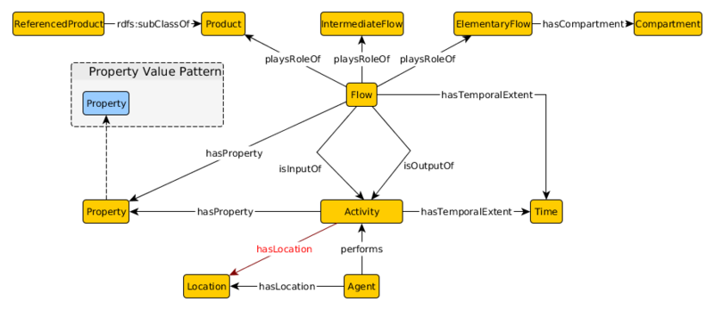

* [Image](../Image/LCAFlow.png#file)
* [File history](../Image/LCAFlow.png#filehistory)
* [Links](../Image/LCAFlow.png#filelinks)

  
Size of this preview: 800 × 348 pixels  
[Full resolution](../images/4/4b/LCAFlow.png)‎ (916 × 398 pixel, file size: 29 KB, MIME type: image/png)

## File history

Click on a date/time to view the file as it appeared at that time.

  
* [Search for duplicate files](http://ontologydesignpatterns.org/wiki/Special:FileDuplicateSearch/LCAFlow.png "Special:FileDuplicateSearch/LCAFlow.png")
* [Edit this file using an external application](http://ontologydesignpatterns.org/wiki/index.php?title=Image:LCAFlow.png&action=edit&externaledit=true&mode=file "Image:LCAFlow.png")See the [setup instructions](http://www.mediawiki.org/wiki/Manual:External_editors "http://www.mediawiki.org/wiki/Manual:External_editors") for more information.

## Links

The following page links to this file:

* [Submissions:LCA Pattern](../Submissions/LCA_Pattern "Submissions:LCA Pattern")

Retrieved from "[http://ontologydesignpatterns.org/wiki/Image:LCAFlow.png](../Image/LCAFlow.png)"