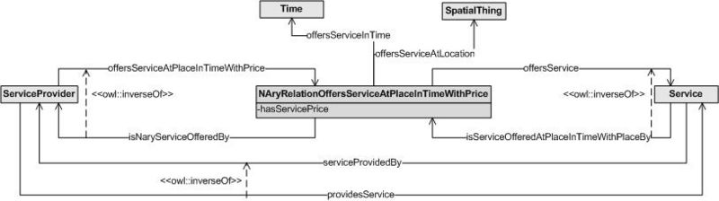

* [Image](../Image/LP-IN-01v1.jpg.md#file)
* [File history](../Image/LP-IN-01v1.jpg.md#filehistory)
* [Links](../Image/LP-IN-01v1.jpg.md#filelinks)

  
Size of this preview: 800 × 224 pixels  
[Full resolution](../images/0/04/LP-IN-01v1.jpg)‎ (813 × 228 pixel, file size: 24 KB, MIME type: image/jpeg)

## File history

Click on a date/time to view the file as it appeared at that time.

  
* [Search for duplicate files](http://ontologydesignpatterns.org/wiki/Special:FileDuplicateSearch/LP-IN-01v1.jpg "Special:FileDuplicateSearch/LP-IN-01v1.jpg")
* [Edit this file using an external application](http://ontologydesignpatterns.org/wiki/index.php?title=Image:LP-IN-01v1.jpg&action=edit&externaledit=true&mode=file "Image:LP-IN-01v1.jpg")See the [setup instructions](http://www.mediawiki.org/wiki/Manual:External_editors "http://www.mediawiki.org/wiki/Manual:External_editors") for more information.

## Links

There are no pages that link to this file.

Retrieved from "[http://ontologydesignpatterns.org/wiki/Image:LP-IN-01v1.jpg](../Image/LP-IN-01v1.jpg.md)"