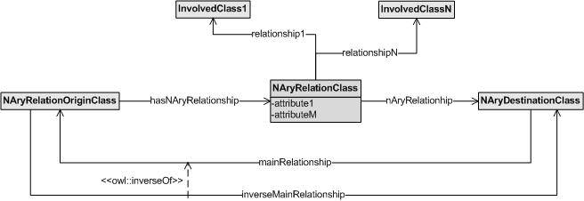

* [Image](../Image/LP-IN-01v1_general.jpg.md#file)
* [File history](../Image/LP-IN-01v1_general.jpg.md#filehistory)
* [Links](../Image/LP-IN-01v1_general.jpg.md#filelinks)

  
No higher resolution available.  
[LP-IN-01v1\_general.jpg](../images/d/d1/LP-IN-01v1_general.jpg)‎ (656 × 226 pixel, file size: 17 KB, MIME type: image/jpeg)

## File history

Click on a date/time to view the file as it appeared at that time.

  
* [Search for duplicate files](http://ontologydesignpatterns.org/wiki/Special:FileDuplicateSearch/LP-IN-01v1_general.jpg "Special:FileDuplicateSearch/LP-IN-01v1 general.jpg")
* [Edit this file using an external application](http://ontologydesignpatterns.org/wiki/index.php?title=Image:LP-IN-01v1_general.jpg&action=edit&externaledit=true&mode=file "Image:LP-IN-01v1 general.jpg")See the [setup instructions](http://www.mediawiki.org/wiki/Manual:External_editors "http://www.mediawiki.org/wiki/Manual:External_editors") for more information.

## Links

The following page links to this file:

* [Submissions:Summarization of an inverse n-ary relation](../Submissions/Summarization_of_an_inverse_n-ary_relation.md "Submissions:Summarization of an inverse n-ary relation")

Retrieved from "[http://ontologydesignpatterns.org/wiki/Image:LP-IN-01v1\_general.jpg](../Image/LP-IN-01v1_general.jpg.md)"