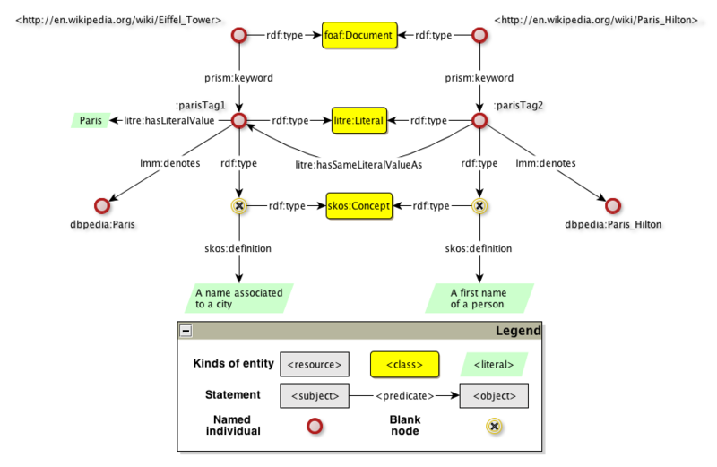

* [Image](../Image/LiteralReificationExample1.png.md#file)
* [File history](../Image/LiteralReificationExample1.png.md#filehistory)
* [Links](../Image/LiteralReificationExample1.png.md#filelinks)

  
Size of this preview: 800 × 521 pixels  
[Full resolution](../../images/c/c7/LiteralReificationExample1.png)‎ (891 × 580 pixel, file size: 60 KB, MIME type: image/png)

## File history

Click on a date/time to view the file as it appeared at that time.

  
* [Search for duplicate files](http://ontologydesignpatterns.org/wiki/Special:FileDuplicateSearch/LiteralReificationExample1.png "Special:FileDuplicateSearch/LiteralReificationExample1.png")
* [Edit this file using an external application](http://ontologydesignpatterns.org/wiki/index.php?title=Image:LiteralReificationExample1.png&action=edit&externaledit=true&mode=file "Image:LiteralReificationExample1.png")See the [setup instructions](http://www.mediawiki.org/wiki/Manual:External_editors "http://www.mediawiki.org/wiki/Manual:External_editors") for more information.

## Links

The following page links to this file:

* [Submissions:Literal Reification/Scenario 1](../Submissions/Literal_Reification/Scenario_1.md "Submissions:Literal Reification/Scenario 1")

Retrieved from "[http://ontologydesignpatterns.org/wiki/Image:LiteralReificationExample1.png](../Image/LiteralReificationExample1.png.md)"