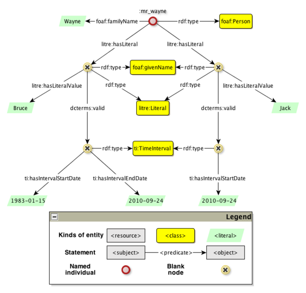

* [Image](../Image/LiteralReificationExample_revised.png#file)
* [File history](../Image/LiteralReificationExample_revised.png#filehistory)
* [Links](../Image/LiteralReificationExample_revised.png#filelinks)

  
Size of this preview: 627 × 600 pixels  
[Full resolution](../images/6/68/LiteralReificationExample_revised.png)‎ (685 × 655 pixel, file size: 47 KB, MIME type: image/png)

## File history

Click on a date/time to view the file as it appeared at that time.

  
* [Search for duplicate files](http://ontologydesignpatterns.org/wiki/Special:FileDuplicateSearch/LiteralReificationExample_revised.png "Special:FileDuplicateSearch/LiteralReificationExample revised.png")
* [Edit this file using an external application](http://ontologydesignpatterns.org/wiki/index.php?title=Image:LiteralReificationExample_revised.png&action=edit&externaledit=true&mode=file "Image:LiteralReificationExample revised.png")See the [setup instructions](http://www.mediawiki.org/wiki/Manual:External_editors "http://www.mediawiki.org/wiki/Manual:External_editors") for more information.

## Links

The following page links to this file:

* [Submissions:Literal Reification/Scenario 2](../Submissions/Literal_Reification/Scenario_2 "Submissions:Literal Reification/Scenario 2")

Retrieved from "[http://ontologydesignpatterns.org/wiki/Image:LiteralReificationExample\_revised.png](../Image/LiteralReificationExample_revised.png)"