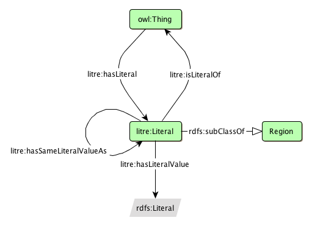

* [Image](../Image/Literalreification.png#file)
* [File history](../Image/Literalreification.png#filehistory)
* [Links](../Image/Literalreification.png#filelinks)

  
No higher resolution available.  
[Literalreification.png](../images/8/81/Literalreification.png)‎ (511 × 371 pixel, file size: 13 KB, MIME type: image/png)A diagram for the proposed Literal Reification pattern

## File history

Click on a date/time to view the file as it appeared at that time.

  
* [Search for duplicate files](http://ontologydesignpatterns.org/wiki/Special:FileDuplicateSearch/Literalreification.png "Special:FileDuplicateSearch/Literalreification.png")
* [Edit this file using an external application](http://ontologydesignpatterns.org/wiki/index.php?title=Image:Literalreification.png&action=edit&externaledit=true&mode=file "Image:Literalreification.png")See the [setup instructions](http://www.mediawiki.org/wiki/Manual:External_editors "http://www.mediawiki.org/wiki/Manual:External_editors") for more information.

## Links

There are no pages that link to this file.

Retrieved from "[http://ontologydesignpatterns.org/wiki/Image:Literalreification.png](../Image/Literalreification.png)"