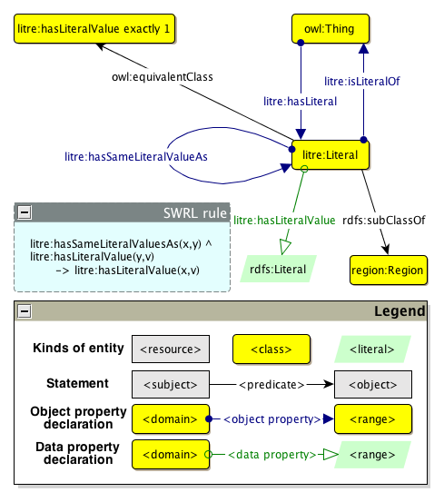

* [Image](../Image/Literalreification_new.png#file)
* [File history](../Image/Literalreification_new.png#filehistory)
* [Links](../Image/Literalreification_new.png#filelinks)

  
No higher resolution available.  
[Literalreification\_new.png](../images/1/12/Literalreification_new.png)‎ (489 × 553 pixel, file size: 39 KB, MIME type: image/png)

## File history

Click on a date/time to view the file as it appeared at that time.

  
* [Search for duplicate files](http://ontologydesignpatterns.org/wiki/Special:FileDuplicateSearch/Literalreification_new.png "Special:FileDuplicateSearch/Literalreification new.png")
* [Edit this file using an external application](http://ontologydesignpatterns.org/wiki/index.php?title=Image:Literalreification_new.png&action=edit&externaledit=true&mode=file "Image:Literalreification new.png")See the [setup instructions](http://www.mediawiki.org/wiki/Manual:External_editors "http://www.mediawiki.org/wiki/Manual:External_editors") for more information.

## Links

The following page links to this file:

* [Submissions:Literal Reification](../Submissions/Literal_Reification "Submissions:Literal Reification")

Retrieved from "[http://ontologydesignpatterns.org/wiki/Image:Literalreification\_new.png](../Image/Literalreification_new.png)"