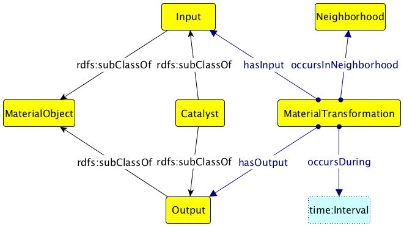

* [Image](../Image/Material-transformation.jpg.md#file)
* [File history](../Image/Material-transformation.jpg.md#filehistory)
* [Links](../Image/Material-transformation.jpg.md#filelinks)

  
No higher resolution available.  
[Material-transformation.jpg](../images/c/c4/Material-transformation.jpg)‎ (661 × 372 pixel, file size: 30 KB, MIME type: image/jpeg)Graphical representation of Material Transformation Pattern

## File history

Click on a date/time to view the file as it appeared at that time.

  
* [Search for duplicate files](http://ontologydesignpatterns.org/wiki/Special:FileDuplicateSearch/Material-transformation.jpg "Special:FileDuplicateSearch/Material-transformation.jpg")
* [Edit this file using an external application](http://ontologydesignpatterns.org/wiki/index.php?title=Image:Material-transformation.jpg&action=edit&externaledit=true&mode=file "Image:Material-transformation.jpg")See the [setup instructions](http://www.mediawiki.org/wiki/Manual:External_editors "http://www.mediawiki.org/wiki/Manual:External_editors") for more information.

## Links

The following page links to this file:

* [Submissions:Material Transformation](../Submissions/Material_Transformation.md "Submissions:Material Transformation")

Retrieved from "[http://ontologydesignpatterns.org/wiki/Image:Material-transformation.jpg](../Image/Material-transformation.jpg.md)"