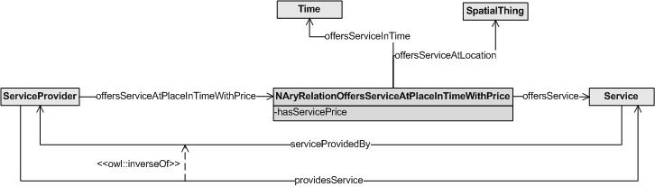

* [Image](../Image/N_aria_provider_service.JPG.md#file)
* [File history](../Image/N_aria_provider_service.JPG.md#filehistory)
* [Links](../Image/N_aria_provider_service.JPG.md#filelinks)

  
No higher resolution available.  
[N\_aria\_provider\_service.JPG](../images/4/4f/N_aria_provider_service.JPG)‎ (726 × 207 pixel, file size: 19 KB, MIME type: image/jpeg)

## File history

Click on a date/time to view the file as it appeared at that time.

  
* [Search for duplicate files](http://ontologydesignpatterns.org/wiki/Special:FileDuplicateSearch/N_aria_provider_service.JPG "Special:FileDuplicateSearch/N aria provider service.JPG")
* [Edit this file using an external application](http://ontologydesignpatterns.org/wiki/index.php?title=Image:N_aria_provider_service.JPG&action=edit&externaledit=true&mode=file "Image:N aria provider service.JPG")See the [setup instructions](http://www.mediawiki.org/wiki/Manual:External_editors "http://www.mediawiki.org/wiki/Manual:External_editors") for more information.

## Links

The following page links to this file:

* [Submissions:Summarization of an inverse n-ary relation](../Submissions/Summarization_of_an_inverse_n-ary_relation.md "Submissions:Summarization of an inverse n-ary relation")

Retrieved from "[http://ontologydesignpatterns.org/wiki/Image:N\_aria\_provider\_service.JPG](../Image/N_aria_provider_service.JPG.md)"