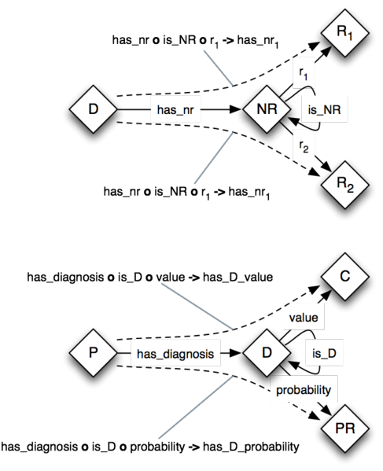

* [Image](../Image/Nary-relation.png.md#file)
* [File history](../Image/Nary-relation.png.md#filehistory)
* [Links](../Image/Nary-relation.png.md#filelinks)

  
Size of this preview: 487 × 599 pixels  
[Full resolution](../../images/0/04/Nary-relation.png)‎ (662 × 814 pixel, file size: 109 KB, MIME type: image/png)Diagram and example for an N-Ary Relation pattern in OWL 2

## File history

Click on a date/time to view the file as it appeared at that time.

  
* [Search for duplicate files](http://ontologydesignpatterns.org/wiki/Special:FileDuplicateSearch/Nary-relation.png "Special:FileDuplicateSearch/Nary-relation.png")
* [Edit this file using an external application](http://ontologydesignpatterns.org/wiki/index.php?title=Image:Nary-relation.png&action=edit&externaledit=true&mode=file "Image:Nary-relation.png")See the [setup instructions](http://www.mediawiki.org/wiki/Manual:External_editors "http://www.mediawiki.org/wiki/Manual:External_editors") for more information.

## Links

The following page links to this file:

* [Submissions:N-Ary Relation Pattern (OWL 2)](../Submissions/N-Ary_Relation_Pattern_(OWL_2).md).html "Submissions:N-Ary Relation Pattern (OWL 2)")

Retrieved from "[http://ontologydesignpatterns.org/wiki/Image:Nary-relation.png](../Image/Nary-relation.png.md)"