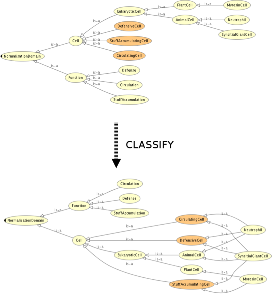

* [Image](../Image/Normalisation_instance.png#file)
* [File history](../Image/Normalisation_instance.png#filehistory)
* [Links](../Image/Normalisation_instance.png#filelinks)

  
Size of this preview: 551 × 599 pixels  
[Full resolution](../images/e/ef/Normalisation_instance.png)‎ (786 × 855 pixel, file size: 103 KB, MIME type: image/png)Sample structure of the Normalization ODP.

## File history

Click on a date/time to view the file as it appeared at that time.

  
* [Search for duplicate files](http://ontologydesignpatterns.org/wiki/Special:FileDuplicateSearch/Normalisation_instance.png "Special:FileDuplicateSearch/Normalisation instance.png")
* [Edit this file using an external application](http://ontologydesignpatterns.org/wiki/index.php?title=Image:Normalisation_instance.png&action=edit&externaledit=true&mode=file "Image:Normalisation instance.png")See the [setup instructions](http://www.mediawiki.org/wiki/Manual:External_editors "http://www.mediawiki.org/wiki/Manual:External_editors") for more information.

## Links

The following page links to this file:

* [Submissions:Normalization](../Submissions/Normalization "Submissions:Normalization")

Retrieved from "[http://ontologydesignpatterns.org/wiki/Image:Normalisation\_instance.png](../Image/Normalisation_instance.png)"